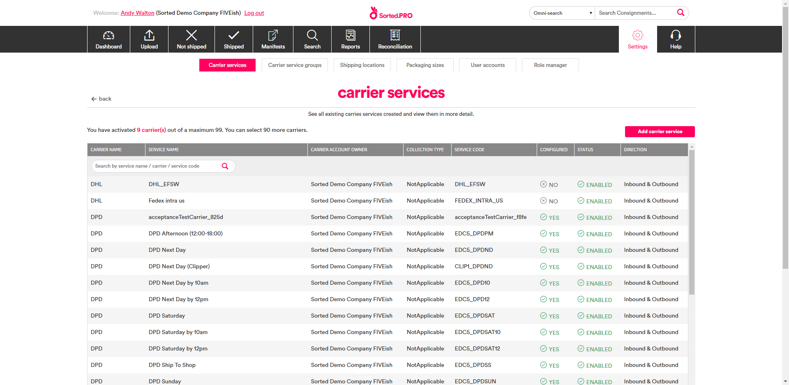
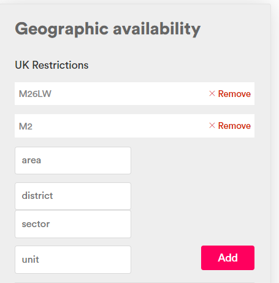
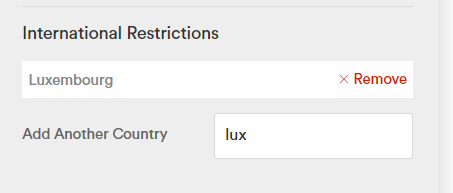

# Allocating Consignments to Carriers

Once you've created a consignment, you'll need to allocate it to a carrier service. This section explains how to configure allocation rules that PRO can use when selecting carrier services, and the various methods you can use to allocate consignments to those services.

---

## What Is Allocation?

In the context of SortedPRO, **allocation** is the process of selecting the carrier service that will be used to deliver a consignment. Allocation is a key part of all PRO workflows, as a consignment cannot be shipped if it has not previously been allocated to a suitable carrier service.

> <span class="note=header">Note:</span>
>
> You can only allocate consignments that are in a consignment state of either _Unallocated_ or _Allocation Failed_. If you attempt to allocate a consignment that is not in one of those states, PRO returns an error.

To allocate a consignment in PRO, you'll need to call one of PRO's allocation endpoints. You can specify a carrier service to allocate to, allocate based on a quote you received, or have PRO select the cheapest eligible carrier service for you. Whichever endpoint you use, PRO uses pre-defined allocation rules to ensure that your consignment is allocated to a suitable carrier service.

PRO offers the following allocation endpoints:

<table class="endpointTable">
    <tr>
        <th width="55%">Endpoint</th>
        <th width="33%">Description</th>
        <th width="12%">API Reference</th>
    </tr>
    <tr>
        <td>
            <p><a href="/api/help/allocating_using_default_allocation_rules.html">Allocate Using Default Rules</a></p>
            <p><pre>PUT https://api.electioapp.com/allocation/allocate</pre></p>
        </td>
        <td>Allocates one or more consignments based on your organisation's custom allocation rules</td>
        <td><a href="https://docs.electioapp.com/#/api/AllocateUsingDefaultRules">Link</a></td>                
    </tr>
    <tr>
        <td width="55%">
            <p><a href="/api/help/allocating_using_default_allocation_rules.html">Allocate Consignment</a></p> 
            <p><pre>PUT https://api.electioapp.com/allocation/{consignmentReference}/allocatewithcheapestquote</pre></p>
        </td>
        <td width="33%">Allocates a single consignment to the cheapest available carrier service</td>
        <td width="12%"><a href="https://docs.electioapp.com/#/api/AllocateConsignment">Link</a></td>                
    </tr>        
    <tr>
        <td>
            <p><a href="/api/help/allocating_via_service_group.html">Allocate Consignment With Service Group</a></p>
            <p><pre>PUT https://api.electioapp.com/allocation/{consignmentReference}/allocatewithservicegroup/{mpdCarrierServiceGroupReference}</pre></p>
        </td>
        <td>Allocates a consignment to the cheapest available carrier service in a particular carrier service group</td>
        <td><a href="https://docs.electioapp.com/#/api/AllocateConsignmentWithServiceGroup">Link</a></td>               
    </tr>
    <tr>
        <td>
            <p><a href="/api/help/allocating_to_a_specific_carrier_service.html">Allocate With Carrier Service</a></p>
            <p><pre>PUT https://api.electioapp.com/allocation/allocatewithcarrierservice</pre></p>
        </td>
        <td>Allocates one or more consignments to a specific carrier service</td>
        <td><a href="https://docs.electioapp.com/#/api/AllocateWithCarrierService">Link</a></td>            
    </tr>
    <tr>
        <td>
            <p><a href="/api/help/allocating_to_a_specific_quote.html">Allocate With Quote</a></p>
            <p><pre>PUT https://api.electioapp.com/allocation/{consignmentReference}/Route parameter: {consignmentReference}allocatewithquote/{quoteReference}</pre></p>
        </td>
        <td>Allocates an individual consignment based on a specific delivery quote from a carrier</td>
        <td><a href="https://docs.electioapp.com/#/api/AllocateConsignmentWithServiceGroup">Link</a></td>                
    </tr>            
</table>

> <span class="note-header">More Information:</span>
>
> For detailed information on using each of PRO's allocation endpoints, click the endpoint names in the table above. 

When a consignment is allocated to a carrier service, its status changes to _Allocated_, enabling you to retrieve its package labels and (where applicable) customs documentation. PRO also returns an Allocation Summary, confirming the service that the consignment was allocated to and (where applicable) providing tracking details.

## What Is an Allocation Rule?

When you make an allocation request for a consignment, PRO uses its allocation rules to ascertain which carrier services are eligible to ship that consignment and which are not. Allocation rules are optional criteria that define the consignments that a particular carrier service is eligible to take. You can specify the following:

* Maximum and minimum dimensions and weight 
* Maximum monetary value
* Excluded UK postcode areas
* Excluded countries 
* Allocation tags. 

For example, you could specify that a particular carrier service should only be allocated consignments that weigh between 1-25 Kg. Subsequently, PRO would not consider this service when allocating a consignment with a weight of 30Kg. 

### Configuring Allocation Rules

Allocation rules must be configured in the PRO UI. To configure allocation rules:

1. Log in to the PRO UI and open the [Carrier Services](https://www.electioapp.com/Configuration/carrierservices/) page (**Settings** > **Carrier Services**) to display a list of available carrier services.
  
    

2. Select the carrier service you want to configure rules for and then click **Allocation Rules** to display the **Manage Carrier Service Rules** page.
  
    

3. If required, enter maximum dimensions or weights. To do so:
    1. In the **Dimensions** panel, click **Add** on the rule you want to set up (one of **Allowed Weight**, **Allowed Girth**, or **Allowed Length**). PRO displays editable range fields.
      
        

    2. Enter the range values for the rule.
    3. Click **Save** to confirm your changes. PRO displays your new rule under the relevant field. 
      
        

        You can edit your new rule using the range boxes, or click **Remove** to remove it altogether.
      
4. If required, enter an **Allowed Compensation Value**. This is the maximum monetary consignment value that the service can take.
5. If required, add an allocation tag by entering the tag name into the **Allocation Filtering Tags** field and clicking **Add**. PRO will only allocate those consignments that have a corresponding value in their `tags` property to the carrier service.

    

    To remove a tag from a carrier service, click the **x** on its icon. 

    > <span class="note-header">More Information:</span>
    >
    > For more information on how allocation tags work, see [What Is an Allocation Tag?](#what-is-an-allocation-tag).

6. If required, enter a UK postcode restriction. To do so, enter the postcode **area**, **district**, **sector**, and/or **unit** you want to restrict delivery to into the fields on the **Geographic Availability** panel and then click the **Add** button. PRO displays the restricted postcode area in the panel.

        

    To remove a restriction, click **Remove**.

    > <span class="note-header">Note:</span>
    >
    > The **Geographic Availability** fields enable you to be flexible when restricting postcodes for a carrier service. For example, if you wanted to prevent a carrier service from being allocated to any consignments bound for the specific postcode _M2 6LW_, you would enter the following:
    >
    > * **area** - _M_
    > * **district** - _2_
    > * **sector** - _6_
    > * **unit** - _LW_
    >
    > However, if you wanted to prevent the service from being allocated to any consignments bound for the entire _M2_ postcode area, you could simple enter _M_ into the **area** field and _2_ into the **district** field, and leave the more specific fields blank.
    >
    > For more information on UK postcode structures, see [this article](https://en.wikipedia.org/wiki/Postcodes_in_the_United_Kingdom#Formatting).

7. If required, enter international delivery restrictions. To do so, start typing the name of the country you want to restrict delivery to into the **Add Another Country** field, and then click **Add** on the relevant country.

        

    To remove a country from the list, click its **remove** button.

8. Click **Save** to save your changes and finish setting up allocation rules.

## What Is an Allocation Tag?

Allocation tags are a type of allocation rule that enables you to filter the list of available carrier services on a per-consignment basis, no matter which allocation endpoint you use in your integration. They are generally used as a flexible means of excluding carrier services that would not be suitable for a particular consignment. 

Tagged consignments can only be allocated to those carrier services that have a matching tag. You can still allocate untagged shipments to a carrier service that has tags.

For example, a retailer might use the UI to add a `Flammables` tag to all the carrier services that they wanted to use for flammable products. They would then add the `Flammables` tag to all consignments containing flammable products. PRO would only allocate those consignments tagged as `Flammables` to a consignment in the pre-approved `Flammables` list.

### Configuring Allocation Tags

To associate tags with carrier services, use the **Settings > [Carrier Services](https://www.electioapp.com/Configuration/carrierservices/) > [select carrier service] > Allocation Rules > Allocation Filtering Tags** panel of the PRO UI, as detailed in [Configuring Allocation Rules](#configuring-allocation-rules).

To tag a consignment, add the required tag into the shipment's `tags` property, either at creation or via the [Update Consignment](https://docs.electioapp.com/#/api/UpdateConsignment) endpoint. The `tags` property is a simple array listing all the tags that apply to the shipment.

The code sample below shows a `tags` property for a consignment that contains flammable materials, oil and alcohol.

<div class="tab">
    <button class="staticTabButton">Example Tags array</button>
    <div class="copybutton" onclick="CopyToClipboard(this, 'tagsExample')"><span class='glyphicon glyphicon-copy'></span><span class='copy'>Copy</span></div>
</div>

<div id="tagsExample" class="staticTabContent" onclick="CopyToClipboard(this, 'tagsExample')">

```json
"Tags": [
   "Flammables",
   "Oil",
   "Alcohol"
]
```

</div>

### Tags Example

Suppose that you set your carrier services up in the following way:

* You tag Carrier Service A with `Alcohol`
* You tag Carrier Service B with `Flammables`
* You tag Carrier Service C with `Alcohol` and `Flammables`
* You tag Carrier Service D with `Oil`
* You don't add any tags to Carrier Service E

This configuration would produce the following results:

* **Consignment with no tags** - A B C D and E are returned
* **Consignment tagged with** `Alcohol` - A and C are returned
* **Consignment tagged with** `Flammables` - B and C are returned
* **Consignment tagged with** `Alcohol` **and** `Flammables` - C is returned
* **Consignment tagged with** `Alcohol`**,** `Flammables`**, and** `Oil` - No services are returned

## After Allocation

Once allocated to a suitable carrier service, the consignment's status changes to _Allocated_, enabling you to retrieve its package labels and (where applicable) customs documentation. All allocation endpoints also return an Allocation Summary, either singularly or (where multiple consignments have been allocated at once) in an array. 

The Allocation Summary contains links to the consignment resource that was allocated, a summary of the carrier service that the consignment was allocated to, a link to the relevant package labels, and a `ConsignmentLegs` array indicating how many legs the shipment will need. Where a shipment would need multiple legs to complete, the `ConsignmentLegs` array shows tracking details for each individual leg.

In the example, a consignment with a `{consignmentReference}` of _EC-000-05B-MMA_ has been allocated to a (dummy) carrier service called _Carrier X Next Day Super_.

### Allocation Summary Example

<div class="tab">
    <button class="staticTabButton">Example Allocation Summary</button>
    <div class="copybutton" onclick="CopyToClipboard(this, 'allocationSummary')"><span class='glyphicon glyphicon-copy'></span><span class='copy'>Copy</span></div>
</div>

<div id="allocationSummary" class="staticTabContent" onclick="CopyToClipboard(this, 'allocationSummary')">

```json
[
    {
        "StatusCode": 200,
        "ApiLinks": [
            {
                "Rel": "detail",
                "Href": "https://api.electioapp.com/consignments/EC-000-05B-MMA"
            },
            {
                "Rel": "label",
                "Href": "https://api.electioapp.com/labels/EC-000-05B-MMA"
            }
        ],
        "Description": "Consignment EC-000-05B-MMA has been successfully allocated with Carrier X Next Day Super for shipping on 14/06/2019 17:00:00 +00:00",
        "ConsignmentLegs": [
            {
                "Leg": 1,
                "TrackingReferences": [
                    "TRK00009823"
                ],
                "CarrierReference": "CARRIER_X",
                "CarrierServiceReference": null,
                "CarrierName": "Carrier X"
            }
        ],
        "CarrierReference": "CARRIER_X",
        "CarrierName": "Carrier X",
        "CarrierServiceReference": "CX_NDS",
        "CarrierServiceName": "Next Day Super"
    }
]
```
</div>

## Allocation Section Contents

* [Viewing Available Carrier Services](/api/help/viewing_available_carrier_services.html) - Explains how to get a list of the carriers and services available with your subscription.
* [Allocating Consignments To The Cheapest Quote](/api/help/allocating_to_the_cheapest_quote.html) - Explains how to allocate a consignment to the cheapest eligible quote.
* [Allocating to a Specific Carrier Service](/api/help/allocating_to_a_specific_carrier_service.html) - Explains how to allocate a consignment to a specific carrier service.
* [Allocating Via Service Group](/api/help/allocating_via_service_group.html) - Explains how to allocate a consignment to the cheapest available service in the specific carrier service group.
* [Allocating Using Default Rules](/api/help/allocating_using_default_rules.html) - Explains how to allocate a consignment based on custom business rules.
* [Allocating to a Specific Quote](/api/help/allocating_to_a_specific_quote.html) - Explains how to allocate a consignment based on a specific delivery quote from a carrier.
* [Deallocating Consignments](/api/help/deallocating_consignments.html) - Explains how to return a consignment to a deallocated state.

<script src="../../scripts/requesttabs.js"></script>
<script src="../../scripts/responsetabs.js"></script>
<script src="../../scripts/copy.js"></script>