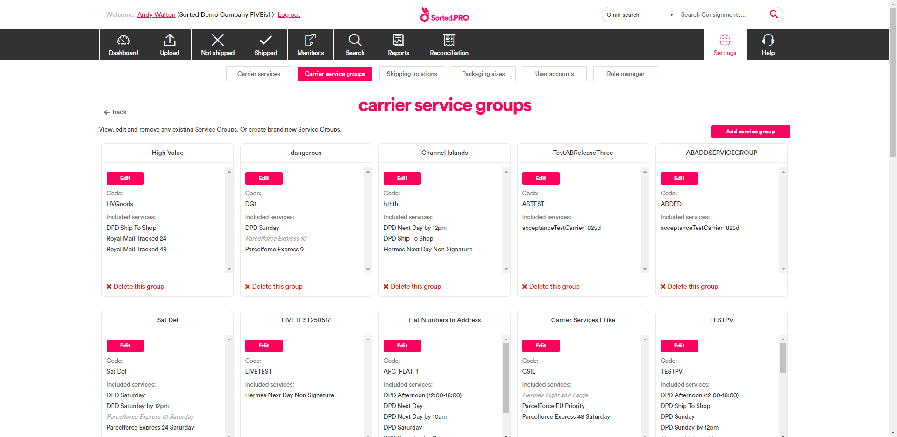

# Allocating Via Service Group

Service groups enable you to specify a custom pool of carrier services to allocate a consignment from. This page explains how to configure service groups, and how to use the **Allocate Consignment With Service Group** endpoint to allocate from within those groups.

---

## What Is a Carrier Service Group?

SortedPRO carrier service groups are user-defined pools of carrier services. They are designed to be used in conjunction with the **[Allocate Consignment With Service Group](https://docs.electioapp.com/#/api/AllocateConsignmentWithServiceGroup)** endpoint as a means of limiting the carrier services that a particular consignment could be allocated to. 

For example, you might set up a group containing all services that will ship dangerous goods. You would then allocate within that group for all consignments involving dangerous items. 

You can use any combination of carrier services in a carrier service group.

## Configuring Carrier Service Groups

You will need to configure carrier service groups in the PRO UI. To add a carrier service groups:

1. Log in to the PRO UI and open the [Carrier Service Groups](https://www.electioapp.com/configuration/carrierservicegroups) page (**Settings** > **Carrier Service Groups**) to display a list of existing carrier service groups.

    

2. Click **Add Service Group** to display the **Add Carrier Service Group** page.

    

3. Enter a **Name** for the new service group. This is used as an identifier for the group within the PRO UI.
4. Enter a **Service Group Code** for the new service group. This is used as an identifier for the group when selecting it via the **Allocate Consignment With Service Group** endpoint (referred to as the `{mpdCarrierServiceGroupReference}` in the reference documentation).
5. Select the services you want to add to the group by clicking on them in the service list.

    If required, you can filter the list of services by clicking **Filter** and entering data into the filter fields displayed. All fields are optional.

    

6. Click **Save** to save the group. A new tile is added for the group on the **Carrier Service Groups** page, and you can now use the group when calling the **Allocate Consignment With Service Group** endpoint.

To edit an existing carrier service group, click its **Edit** link.

To delete an existing carrier service group, click its **Delete This Group** link.

## Using the Allocate With Service Group Endpoint

To call **Allocate Consignment With Service Group**, send a `PUT` request to `https://api.electioapp.com/allocation/{consignmentReference}/allocatewithservicegroup/{mpdCarrierServiceGroupReference}`, where `{consignmentReference}` is the unique reference for the consignment you want to allocate and `{mpdCarrierServiceGroupReference}` is the **Service Group Code** of the group you want to allocate within.

> [!NOTE]
> For full reference information on the <strong>Allocate Consignment With Service Group</strong> endpoint, see the <strong><a href="https://docs.electioapp.com/#/api/AllocateConsignmentWithServiceGroup">Allocate Consignment With Service Group</a></strong> page of the API reference. 

To find the **Service Group Code** for a particular group, log in to the PRO UI, navigate to the **[Carrier Service Groups](https://www.electioapp.com/Configuration/CarrierServiceGroups)** page (**Settings** > **Carrier Service Groups**), and locate the tile for that group. The **Service Group Code** is shown in the **Code** field.

Once the request is received, PRO uses allocation rules to eliminate any carrier services in the group that would not be suitable to take the consignment, allocates the consignment to the cheapest remaining service, and returns an Allocation Summary.

> [!NOTE]
> For information on using allocation rules, see the [What Is An Allocation Rule?](/pro/api/help/allocating_consignments.html#what-is-an-allocation-rule) section of the [Allocating Consignments To Carriers](/pro/api/help/allocating_consignments.html) page.

### Allocate Consignment With Service Group Example

The example shows a request to allocate a consignment with a `{consignmentReference}` of _EC-000-05B-MMA_ within a group that has a `{mpdCarrierServiceGroupReference}` of _valuableGoods_.

# [Allocate Consignment With Service Group Request](#tab/allocate-consignment-with-service-group-request)

`PUT https://api.electioapp.com/allocation/EC-000-05B-MMA/allocatewithservicegroup/valuableGoods`

---

## Next Steps

* Learn about alternative methods of allocating consignments at the [Allocating Consignments](/pro/api/help/allocating_consignments.html) page.
* Learn how to get and print delivery labels at the [Getting Labels](/pro/api/help/getting_labels.html) page.
* Learn how to add consignments to a carrier manifest at the [Manifesting Consignments](/pro/api/help/manifesting_consignments.html) page.