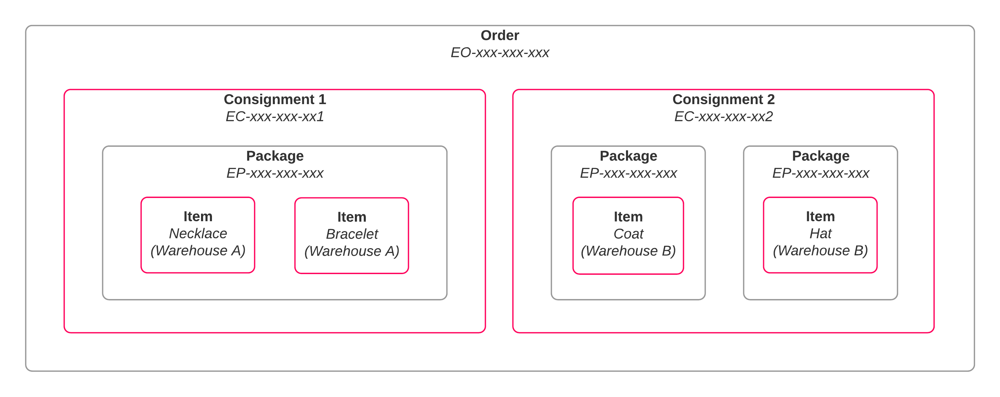

# Managing Orders

SortedPRO's Orders function enables you to process deliveries that would ship from multiple fulfilment centres or warehouses. This section explains how to create order objects, how to create consignments from orders, and how to manage existing orders.

---

## What Is An Order?

In PRO, an order represents a collection of packages that is to be transported to the same destination and on behalf of the same customer. 

At first glance, an order object looks very similar to a consignment object. As such, it's important to understand the difference between a consignment and an order when using **Pack Order**:

* An **order** is a collection of items that is to be transported to the same destination on behalf of the same customer.
* A **consignment** is a collection of packages that is to be transported to the same destination, on behalf of the same customer, _from the same origin, on the same day, and by the same carrier_.

This means that orders can contain items that will not ship from the same location, but consignments cannot. Similarly, orders can contain items that will ship from the same location but at different times (for example, because one of the items a customer has purchased is out of stock).

## Using Orders

Once you have created an order, you would need to use the **Pack Order** endpoint to generate shippable consignments from it. In this stage of the process you are effectively splitting the items on the order up into groups that meet the definition of a consignment (that is: items that share an origin, ship date, and carrier).

Suppose that a clothing retailer has received a customer order for a necklace, a bracelet, a coat, and a hat. As the necklace and bracelet are both physically small, the retailer elects to ship them in the same package. The necklace and bracelet are located in warehouse A, and the coat and hat in warehouse B. This would break down to:

* A single order comprising the customer's entire purchase.
* Two consignments - One with a single item for the package containing the necklace and bracelet, and another with separate packages for the coat and hat.
* Three packages - One containing the necklace and bracelet, one containing the coat, and one containing the hat.
* Four items - The necklace, the bracelet, the coat, and the hat.

In this example, you would need to run **Pack Order** twice - once for each consignment.

   

## Orders Section Contents

* [Creating New Orders](/pro/api/help/creating_new_orders.html)- Explains how to use the **Create Orders** endpoint to create orders from scratch, and how to use the **Select Option As Order** endpoint to generate orders from delivery options.
* [Managing Existing Orders](/pro/api/help/managing_existing_orders.html) - Explains how to retrieve and update order details.
* [Creating Consignments From Orders](/pro/api/help/packing_orders.html) - Explains how to use the **Pack Order** endpoint to split an order into shippable consignments.

