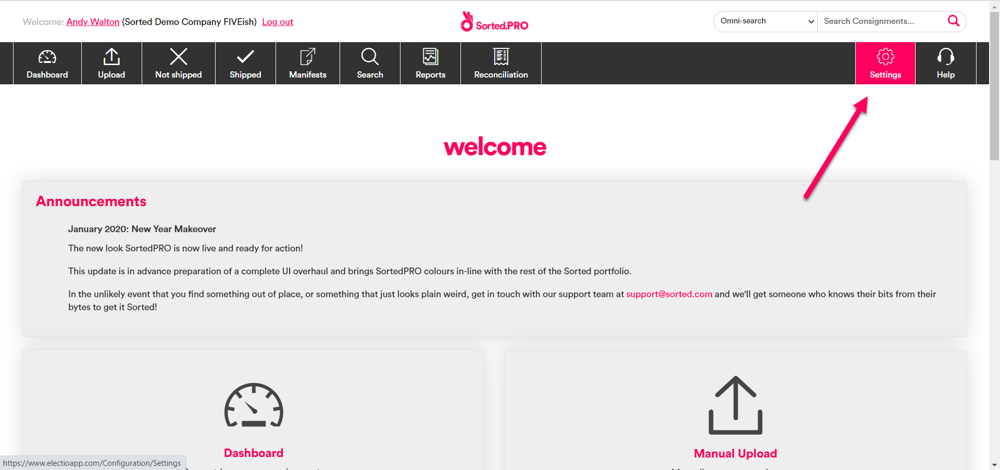
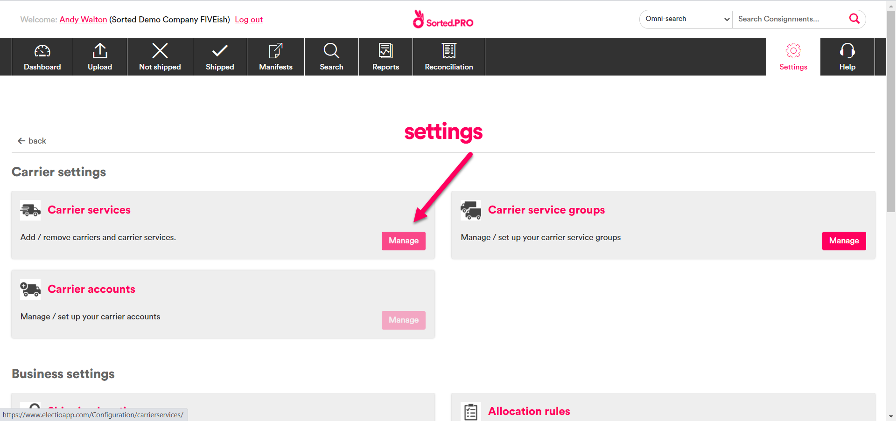
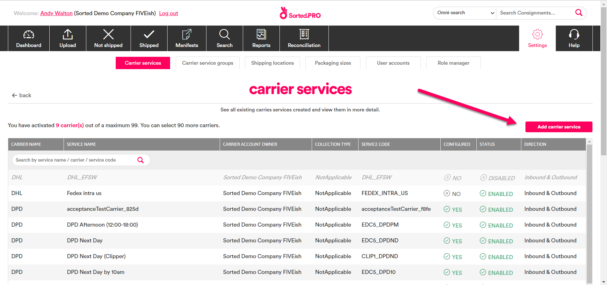
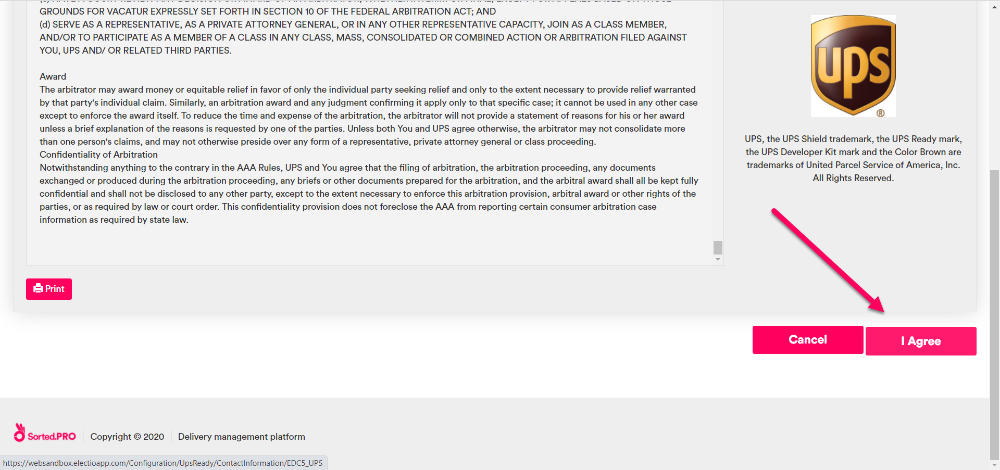
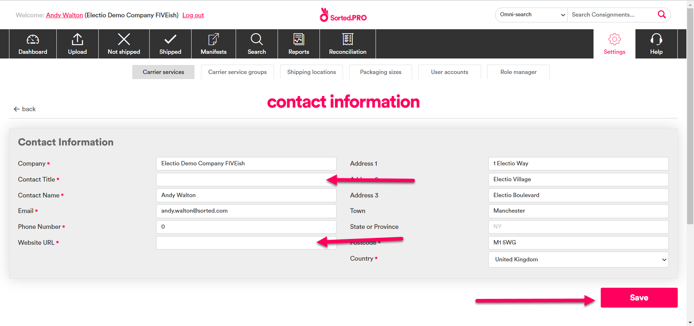
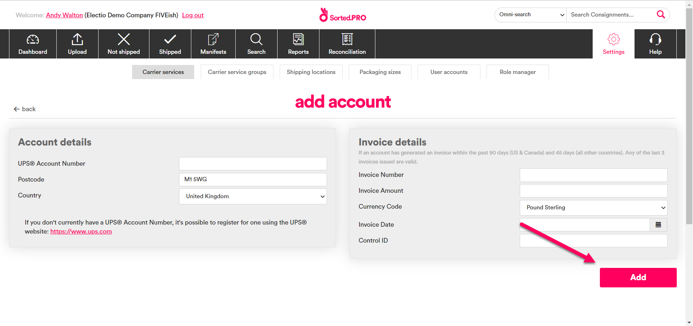
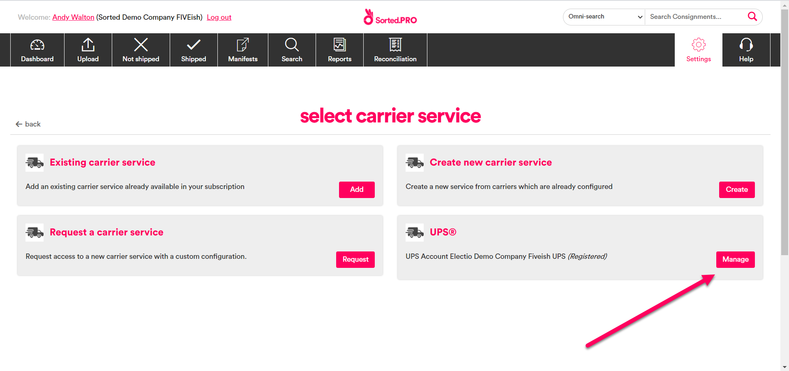
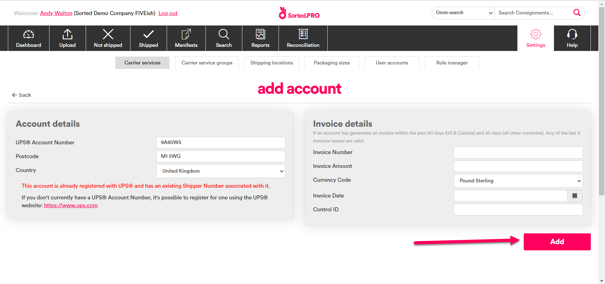

# Client Onboarding Guide for UPS (EU/US)

Sorted are an approved UPS Ready provider. This means that we can provide our customers with the ability to ship products with UPS using SortedPRO without the need for any separate customer certification process. 

This page explains how to configure UPS Ready functionality within PRO.

## Configuring UPS Ready

In order to use UPS Ready functionality within PRO, you will need to register your UPS account number. This step must be completed by Sorted customers as part of the onboarding process, as each customer must accept the terms and conditions of the UPS Technology Agreement (UTA).

To register a new UPS account Number within PRO:

1. Open the PRO UI ([Production](https://web.electioapp.com/) or [Sandbox](https://websandbox.electioapp.com/)) and log in. Select **Settings** to display the **Settings** page.

2. Click **Manage** on the **Carrier Services** panel to display the **Carrier Services** page.

3. Click **Add Carrier Service** to display the **Select Carrier Service** page.

4. Click **Register** on the **UPS** panel to display the UTA. 

5. Read the agreement and then click **I Agree** to display the **Contact Information** page.

6. Add a **Contact Title** and **Website URL** and click the **Save** button to display the **Add Account** page 

7. Add account and invoice details as necessary then click **Add** to complete the setup process.

### Updating Your UPS Details
 
To update your UPS account or invoice details:

1. Return to the **Select Carrier Service** page (**Settings** > **Manage Carrier Services** > **Add Carrier Service**) and click **Manage** on the UPS panel to display the **Add Account** page.

2. Make the required changes and then click the **Add** button to save.

 

### Configuring US Domestic EDI Tracking

US Domestic Services use an EDI tracking solution (as apposed to API). Therefore, you will need to take some additional steps in order to accept the UPS Technology Agreement (UTA) .

The quickest way to onboard UPS EDI services is to sign up for the UPS EDI Click Wrap process. To do so:

1. Contact your local UPS Account Manager, who should submit a request for the process via UPS.com. UPS will respond by sending you an email link.

2. Click the link, log into UPS.com, and approve the UTA by clicking the relevant check box. 

Alternatively, you can approve the UTA via EDI questionnaire. This is a manual process involving UPS's legal teams, and will take much longer than the EDI Click Wrap process.

Once you have approve the UTA, UPS will set up a tracking account via Open Text, their 3rd party provider, and share the relevant SFTP tracking credentials with us.

## Supported UPS Functions

### Origins

PRO supports UPS shipments originating from Europe and the contiguous United States. 

### APIs

The following UPS APIs have been implemented within PRO.

* License
* Registration
* Rating
* Time in Transit
* Locator
* Shipping
* Tracking (EU origin only. For US Domestic services see the [Configuring US Domestic EDI Tracking](#configuring-us-domestic-edi-tracking) section)

## Carrier Services

PRO supports the following UPS services for shipments with an EU origin:

* UPS Standard with signature request
* UPS Express with signature request
* UPS Express Saver with signature request
* UPS Express Plus with signature request
* Delivery to Access Point – UPS Standard

PRO also supports the following UPS services for shipments with a US domestic origin:

* UPS Next Day Air Early
* UPS Next Day Air
* UPS Next Day Air Saver
* UPS 2nd Day Air	
* UPS 3 Day Select
* UPS Ground

Each US service provides options for Signature Required, Adult Signature Required and Saturday deliveries, as well as delivery to Access Points where applicable.
