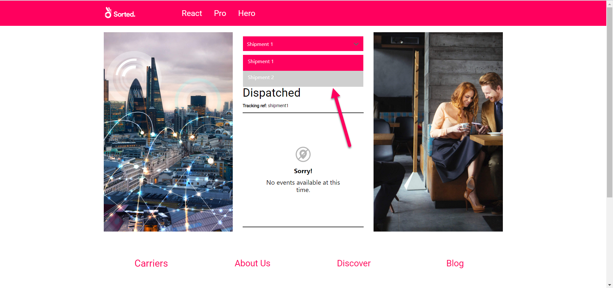
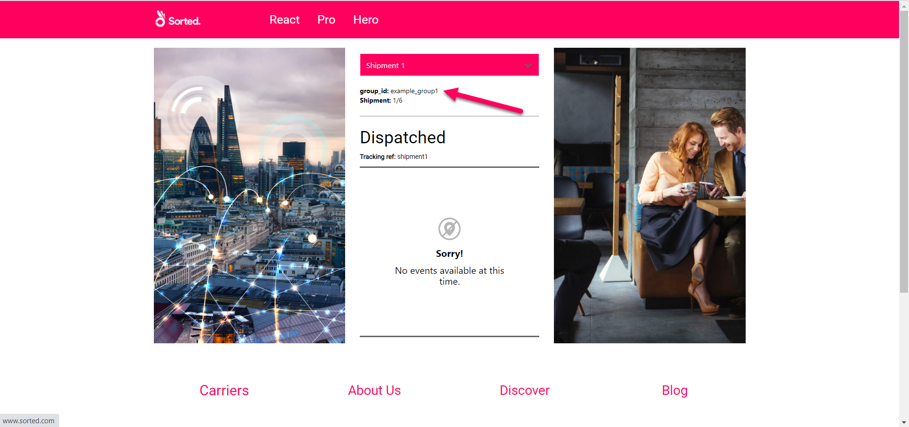
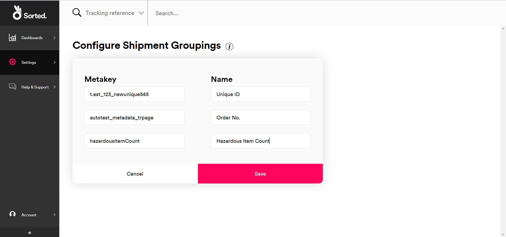
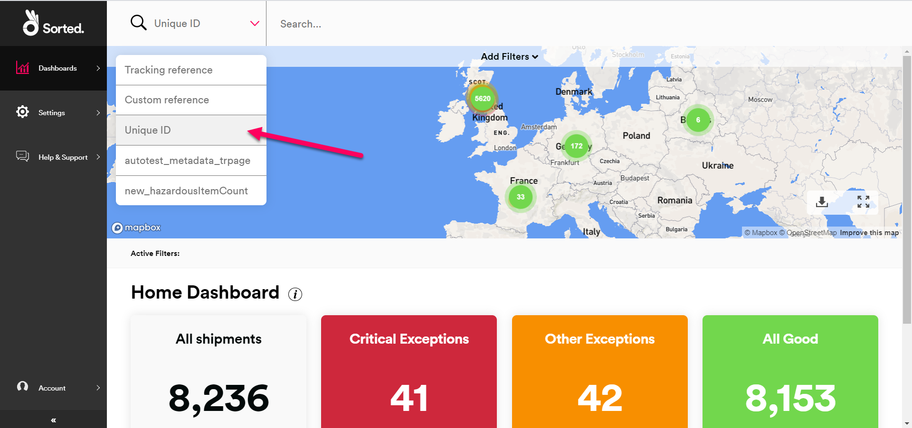
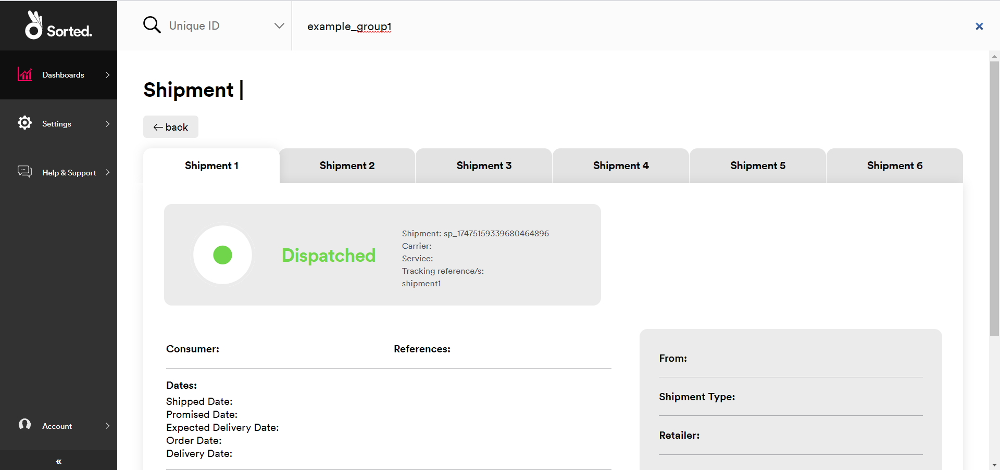

# Grouping Shipments

REACT shipment groups help you to track orders that will take more than one shipment to fulfil. This page explains how to use metadata to group shipments together, how to view shipment groups in the REACT UI, and how to present grouped shipments to your customers using REACT's tracking pages.

---

## Shipment Groups Overview

In REACT, a shipment is a singly-tracked consignment of goods that are being shipped together from a single origin location to a single destination location. Shipment groups enable you to link related shipments together so that they can be tracked through the same page.

For example, suppose that a clothing retailer has received an order for a coat and a hat. At the time of order, the two items are physically located in two different warehouses. This means that they will need to be sent as two separate shipments, as all items on a shipment must share an origin location.

However, both items are still a single order from the customer's perspective. As such, it would be a better user experience to provide the customer with a single link that they could use to track both shipments, rather than two separate links.

By using shipment groups, you can link these two shipments together via a shared metadata property, enabling you to send tracking details for both as a single link. The page displayed by the link displays tracking information for all shipments tagged with that property, with a drop-down menu enabling customers to switch between all shipments in the group without navigating to a separate page. 

## Registering Grouped Shipments

Shipment groups are based on metadata. If two shipments share an identical metadata property (that is, one that has both the same `key` and `value`), then REACT considers them to be grouped together.

When grouping REACT shipments, the metadata `key` is the grouping (that is, the category by which shipments are grouped together) and the metadata `value` is effectively the name of the group itself. For example, an organisation grouping shipments by order number might use _orderID_ (or similar) as a metadata `key` and their own order number as the `value`. 

The following example shows a request to register four simple shipments at once. The shipments all have a metadata key named `group_name` denoting the group they are in. The first two shipments belong to `example_group1`, and the second two below to `example_group2`.

<div class="tab">
    <button class="staticTabButton">Shipment Groups Example</button>
    <div class="copybutton" onclick="CopyToClipboard(this, 'HTTPRequest')"><span class='glyphicon glyphicon-copy'></span><span class='copy'>Copy</span></div>
</div>

<div id="HTTPRequest" class="staticTabContent" onclick="CopyToClipboard(this, 'HTTPRequest')">

```json
{
    "shipments": [
    	{
            "tracking_references": [
                "shipment1"
            ],
            "metadata": [
                {
                "key": "group_id",
                "value": "example_group1",
                "type": "String"
                }
            ]
    	},
    	{
            "tracking_references": [
                "shipment2"
            ],
            "metadata": [
                {
                "key": "group_id",
                "value": "example_group1",
                "type": "String"
                }
            ]
    	},
        {
            "tracking_references": [
                "shipment3"
            ],
            "metadata": [
                {
                "key": "group_id",
                "value": "example_group2",
                "type": "String"
                }
            ]
    	},
        {
            "tracking_references": [
                "shipment4"
            ],
            "metadata": [
                {
                "key": "group_id",
                "value": "example_group2",
                "type": "String"
                }
            ]
    	}        
    ]
}
```

</div>

To add a pre-existing shipment to a group, use the **Update Shipment** endpoint to add the relevant metadata property to the shipment. Note that REACT's **Update Shipment** endpoint requires you to pass an entire new shipment object, which overwrites the existing shipment resource. As such, you would need to pass all of the shipment's current details as well as the metadata property when adding a shipment to a group.

> <span class="note-header">More Information:</span>
>
> * For more information on registering REACT shipments, see the [Registering Shipments](/react/help/registering-shipments.html) page.
> * For more information on registering REACT shipments, see the [Updating Shipments](/react/help/updating-shipments.html) page.

## Tracking Grouped Shipments

Your customers can view tracking information for a shipment group by visiting `https://react.sorted.com/tracking/[page_title]?customer_id=[customer_id_here]&metadata_key=[metadata_key_here]&metadata_value=[metadata_value_here]`, where `[page_title]` is the title of your tracking page, `[customer_id_here]` is your REACT customer ID, `[metadata_key_here]` is the relevant grouping key and `[metadata_value_here]` is the value that you grouped the shipments together on.

As an example, suppose that a customer with a `customer_id` of _cs_1234567890_ created a tracking page called _examplePage_ and wanted to use it to let a customer view the first two shipments from the code sample given in the previous section. To do so, they would share the following link: `https://react.sorted.com/tracking/examplePage?customer_id=cs_1234567890&metadata_key=group_id&metadata_value=example_group1`

Shipment group tracking pages have a drop-down picker on the tracking widget that enables the customer to select which shipment's tracking information they want to view.



The page also displays the key and value that the shipments are grouped by, and the number of shipments in the group.



Note that REACT only displays the drop-down shipment picker and grouping information if you access the shipment via the shipment group link (that is, you use the shared metadata `key` and `value` to identify the shipments to be displayed). You can still use other valid tracking page link formats to view a shipment that is in a group (such as `shipment_id` or `tracking_reference`), but REACT does not display links to other shipments in the group in this case.

> <span class="note-header">More Information:</span>
>
> For more information on creating and distributing REACT tracking pages, see the [Tracking Pages](/react/help/tracking-pages.html) page.

## Naming Shipment Groupings

The **Configure Shipment Groupings** UI page enables you to specify a friendly name for up to three of the metadata keys that you use for your shipment groupings. 

For example, you might group shipments by a key called `orderID`. The **Configure Shipment Groupings** page enables you to specify a name such as _Order Reference_ (or similar) for that grouping, which REACT would then display on the group tracking page instead of the `orderID` key name.



To name a shipment group:

1. Select **Settings > Shipment Groupings** to display the **Configure Shipment Groupings** UI page. 
2. Enter the **Metakey** of the group you want to name.
3. Enter the name you want to give to the group.
4. Add up to two more keys and names, if required.
5. Click **Save** to save your changes.

To edit your existing group names, click the **Edit** button.

## Searching For Grouped Shipments

You can search for grouped shipments using your named shipment groupings (that is, those shipments that are grouped using the metadata keys configured on the **Configure Shipment Groupings** UI page) via the search bar in the REACT UI. To do so: 

1. From any page of the REACT UI, click the drop-down menu on the search bar and select the name of the grouping (i.e. the metadata key) you want to search by



2. Enter the group name (i.e. the metadata value) and press Enter to display tabbed details of all the shipments in the group.



REACT only displays tabs if you search for shipments by their grouping. If you were to search for the shipment in the example above by its tracking reference, for example, then REACT would only display that shipment's details.

## Next Steps

Read on for more info:

* [REACT Overview](https://docs.sorted.com/react/overview/)
* [Registering Shipments](https://docs.sorted.com/react/registering-shipments/)
* [Managing Webhooks](https://docs.sorted.com/react/managing-webhooks/)
* [Retrieving Shipment and Event Data](https://docs.sorted.com/react/retrieving-data/)

<script src="../../pro/scripts/requesttabs.js"></script>
<script src="../../pro/scripts/responsetabs.js"></script>
<script src="../../pro/scripts/copy.js"></script>