# Monitoring Shipments

REACT's dashboards make keeping track of your shipment performance easy. This page explains how to use REACT's **States**, **Calculated Events**, and **All Shipments** dashboards to get timely information on how your shipments are progressing, and to spot potential problems.

---

## Viewing an Overview of Your Shipments

The **States** dashboard gives you an overview of your current shipments. It indicates how many shipments you have in each particular shipment state, how many shipments are in exception states, and how many shipments you have in each geographical region.

To open the **States** dashboard, select the **Dashboards > States** menu option.

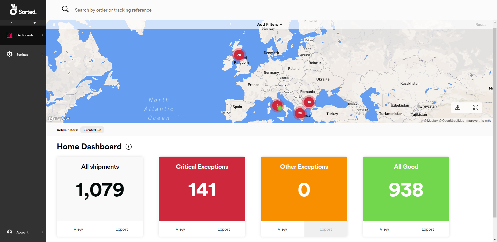

The **States** dashboard uses shipment states to group shipments into red/amber/green categories, helping you to identify individual shipments that may require attention. Shipment states are colour-coded into the following:

* **Red (Critical Exceptions)** - There is an issue with the shipment that cannot be resolved until you take action, or the shipment has been destroyed or lost. For example, a shipment in a state of *Held by carrier* would be classified as red.
* **Amber (Other Exceptions)** - There is an issue with the shipment that does not require you to take action. However, you might want to notify your customers. For example, a shipment in a state of *Delivery failed* would be classified as amber.
* **Green (All Good)** - There is no issue with the shipment. For example, a shipment in a state of *Dispatched* would be classified as green.

For a full list of REACT shipment states, including their colour classification, see the [Shipment States](/react/help/shipment-states.html) page.

The **States** dashboard has two sections: a map indicating the delivery locations of your shipments and a row of tiles indicating how many of your shipments are in each colour status.

> [!NOTE]
>
> Only those shipments for which REACT holds an origin address are displayed on the map. For more information on registering shipment data, see the [Registering Extra Shipment Information](/react/help/registering-shipments.html#registering-extra-shipment-information) section of the [Registering Shipments](/react/help/registering-shipments.html) page. 

If required, you can filter the data displayed using the filter controls explained in the [Filtering Dashboard Data](#filtering-dashboard-data) section.

### Drilling Down on Shipment Details by Status

To view how many shipments you have in each shipment state: 

1. Click the **View** button on the relevant colour tile. For example, to view how many shipments you had in each red shipment state, you would click **View** on the **Critical Exceptions** tile.
   
   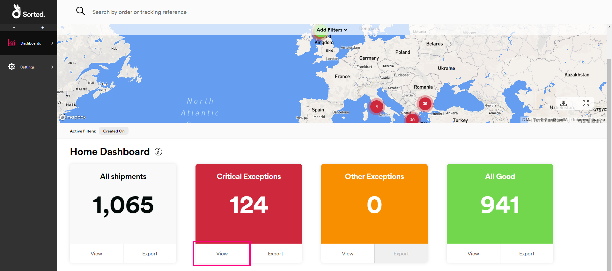
   
   REACT displays tiles indicating how many shipments you have in each state for the selected colour.
   
   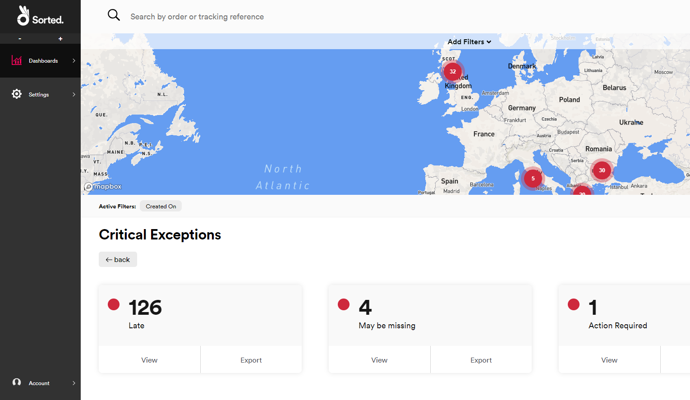 
   
2. To view a list of all the shipments in a particular state, click **View** on that state's tile.
   
   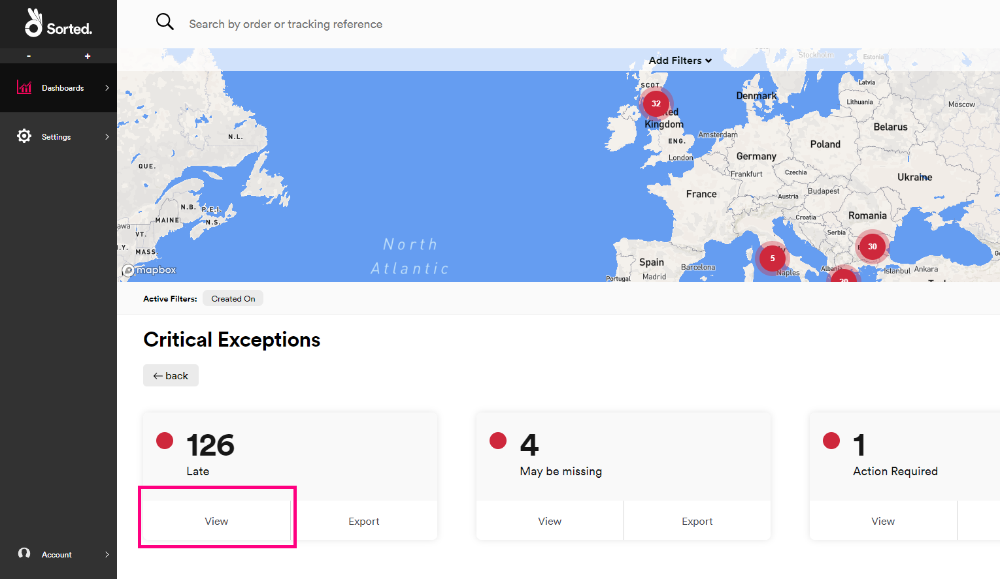
   
   REACT opens the **All Shipments** dashboard, filtered to display the relevant information.
   
   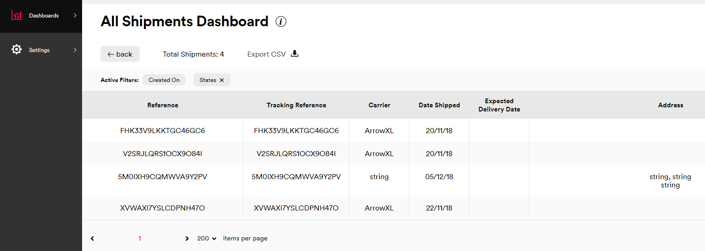

### Drilling Down on Shipment Details by Location

To view a list of all shipments that are currently in a particular geographical location, click a point on the map. 

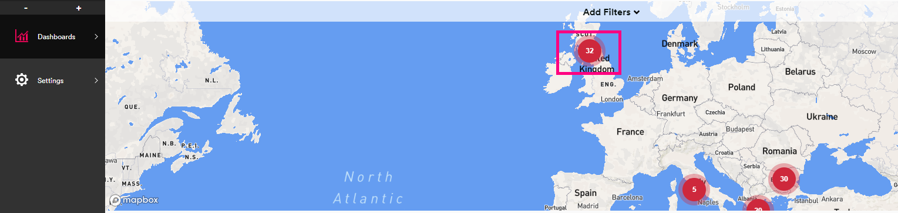

REACT opens the **All Shipments** dashboard, filtered to display the relevant information.

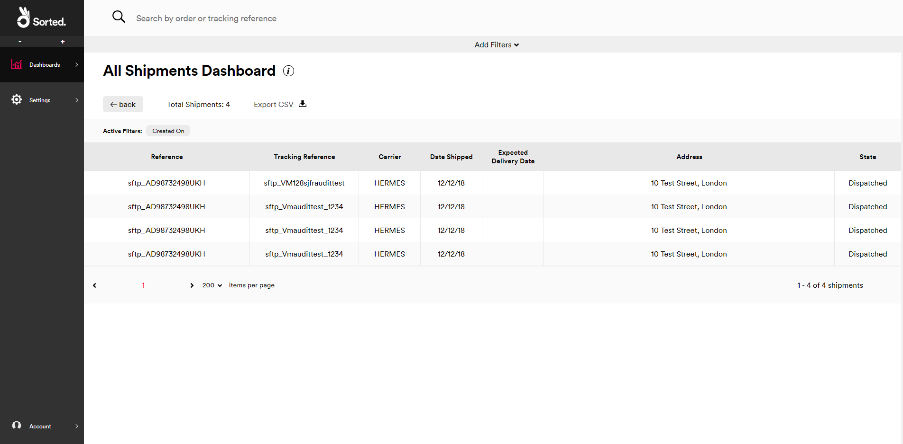

### Exporting Shipment Details to CSV

There are several points on the **States** dashboard from which you can export shipment details to CSV:

To export details of all shipments, click **Export** on the **All shipments** tile.
  
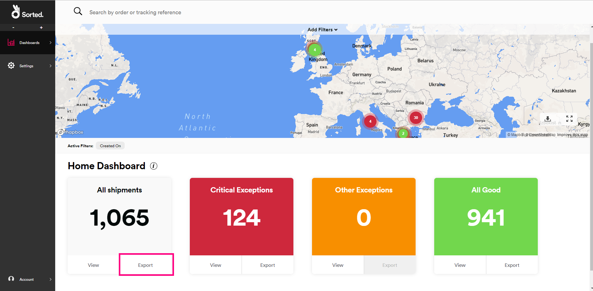

To export details of all shipments in a particular colour status, click **Export** on the relevant colour tile.
  
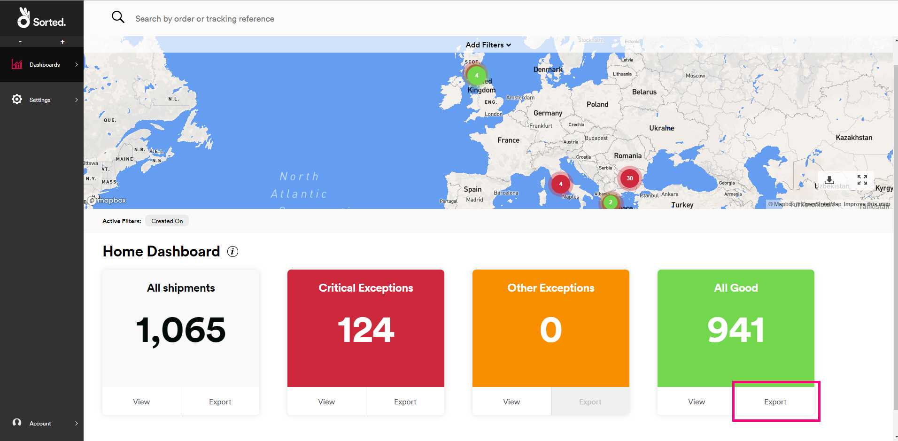

To export details of all shipments in a particular state, click **View** on the relevant colour tile and then click **Export** on the required shipment state tile.
  
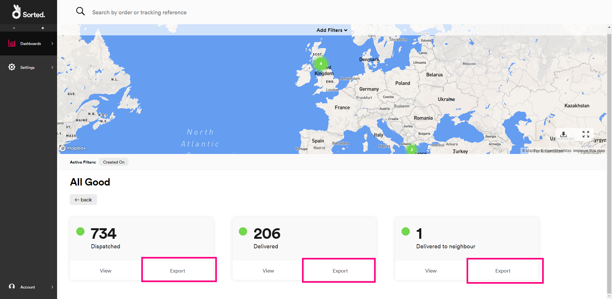

Alternatively, the **Download** button on the map enables you to export whatever data you care currently viewing, including any colour categories you may have selected and filters you may have applied. 

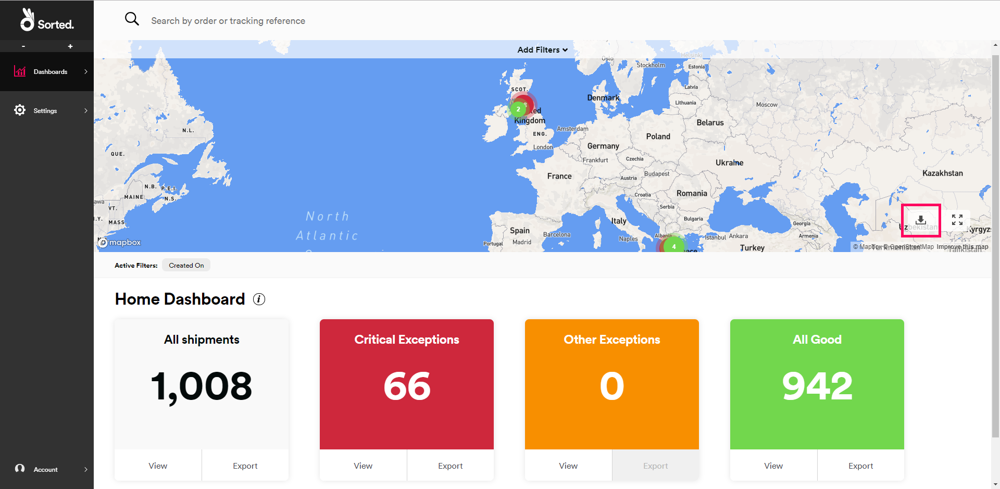

For example, if you click **View** on the red **Critical Exceptions** tile and then click the **Download** button, then REACT exports a CSV file containing all shipments in red statuses. If you were to then apply a filter so that only shipments with a **Promised Date** of tomorrow were displayed, and then click the **Download** button again, then REACT would export a CSV file containing a list of those red shipments that had a **Promised Date** of tomorrow.

## Viewing Calculated Events

The **Calculated Events** dashboard displays the number of your shipments that REACT has flagged as _Late_ or _May Be Missing_. To open the **Calculated Events** dashboard, select the **Dashboards > Calculated Events** menu option.

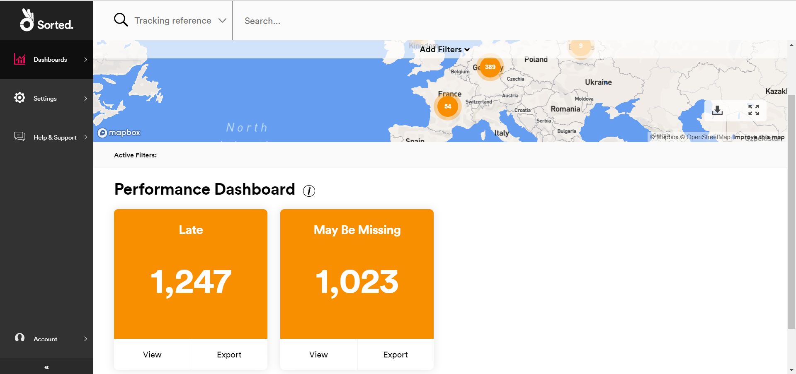

Click **View** on a particular event tile to open a list of shipments that have been flagged with that calculated event in the **All Shipments** dashboard, or click **Export** to export that list to a CSV file.

Alternatively, click a location on the map to open a list of shipments originating from that location that have been flagged as either _Late_ or _May Be Missing_ in the **All Shipments** dashboard.

> [!NOTE]
>
> A calculated event is an event that is generated by REACT's internal processing, rather than as a result of an external tracking update. For more information on how calculated events work in REACT, see the [Calculated Events](/react/help/calc-events.html) page. 

## Cached Shipment Data

To maximise performance, REACT caches data on the **States** and **Calculated Events** dashboards for ten minutes. If you make a particular request (say, clicking the **View** button on the **Critical Exceptions** tile to view how many of your shipments are in each individual red state), and then make an identical request within ten minutes, then REACT displays the cached data it received from the first request rather than making a separate database call. As such, you should bear in mind that the new request will not show any changes that have occurred since the first request was made.

If you make a different request, or if you make the same request more than ten minutes after the first request was made, then REACT refreshes the data.

This caching takes place at an organisational level, rather than a user level. For example, suppose than User A makes a particular request, and then User B makes the same request five minutes later. In this scenario, User B would receive the cached data from user A's request. However, if User B was to make the same request fifteen minutes later, then REACT would obtain new data.   

## Viewing Individual Shipments

The **All Shipments** dashboard gives you a list of all your individual shipments, and enables you to click through to view shipment event data.

To open the **All Shipments** dashboard, select the **Dashboards > All Shipments** menu option, or click **View** on the **All Shipments** tile.

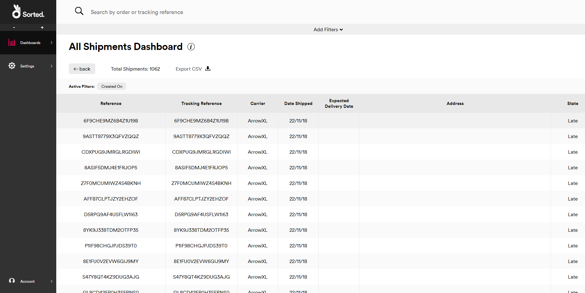

The **All Shipments** dashboard displays a list of all your current shipments. You can filter the list using the filter controls explained in the [Filtering Dashboard Data](#filtering-dashboard-data) section.

To export the data displayed onscreen (including any filters you may have selected), click **Export CSV**.

Select a shipment record to view a summary of the registration and tracking information held on that shipment.

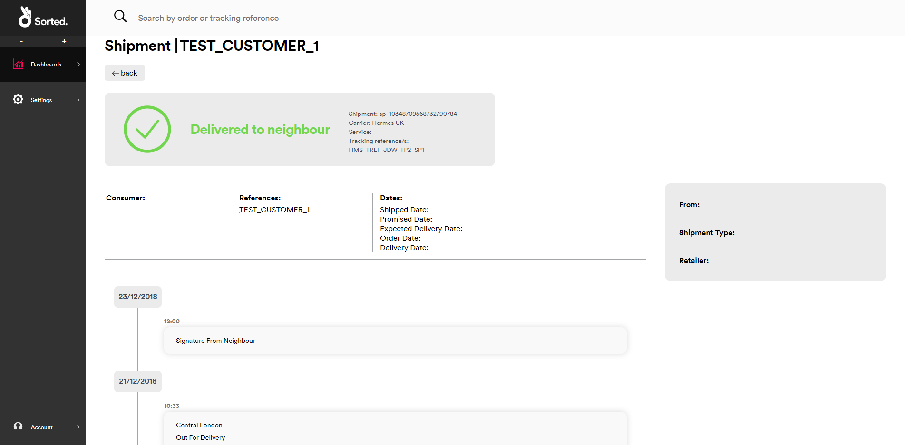

### Adding Shipment Notes

To add a note to a shipment, select that shipment, click **Add Note**, add your message in the text box, and then click **Save**. 

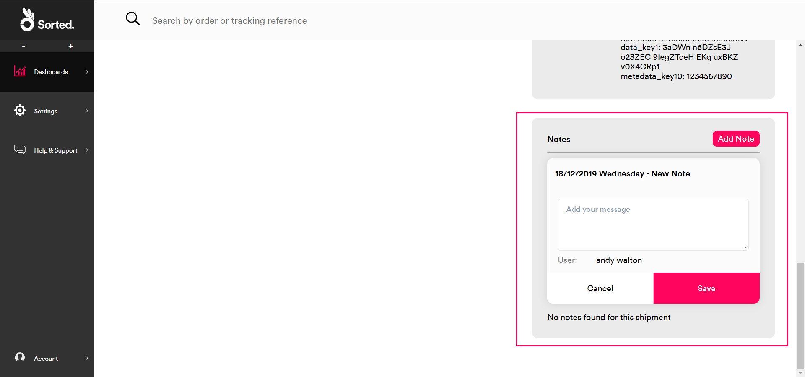

Shipment notes are grouped by date. To view notes for a particular date, click the **+** button next to that date in the **Notes** panel.

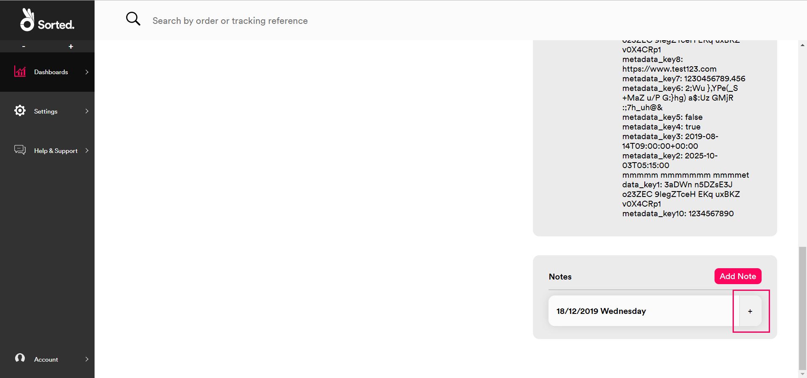

Adding shipment notes can help you to manage exceptions and customer service enquiries, enabling you to record any action or communication that has taken place for that specific shipment.

> [!TIP]
>
> The shipment information displayed in the REACT UI is largely populated from the information provided at registration. The more information you provide at registration, the more useful this page will be. For more information on the information you can provide at registration, see the [Registering Shipments](/react/help/registering-shipments.html) page.

### Searching For a Specific Shipment

All of REACT's UI pages display a search bar at the top. To view a specific shipment's details:

1. Select the parameter you want to search by from the drop-down menu. REACT enables you to search by **Tracking Reference**, **Custom Reference**, or by one of your named shipment groupings.

> Note:
>
> For more information on REACT shipment groups, see the [Grouping Shipments](/react/help/grouping-shipments.html) page.

2. Enter a search value and click the search icon or press Enter to search on the relevant shipment details.

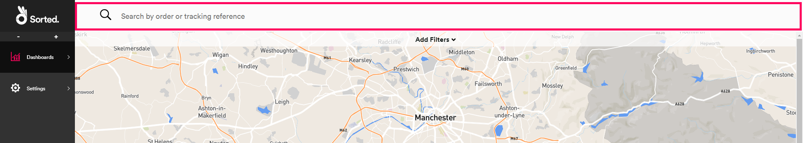  

If REACT only finds one shipment matching your criteria, then it opens the **Shipment** page for that shipment.

If REACT finds multiple shipments matching your criteria, then it opens the **All Shipments** page with all matching shipments listed.

## Filtering Dashboard Data

REACT's dashboards enable you to filter the data displayed. Filtering can be particularly handy if you have large volumes of data to work with. You can filter data by **Carriers**, **States**, **Shipment Origin**, **Shipment Destination**, **Order Date**, **Shipped Date**, **Promised Date**, **Estimated Date**, and **Shipment Type**.

> [!NOTE]
>
> By default, REACT's dashboards only display those shipments created in the last 14 days. You can override this default filtration by adding your own date filters.

To filter data:

1. Click the **Add Filters** drop-down. 

   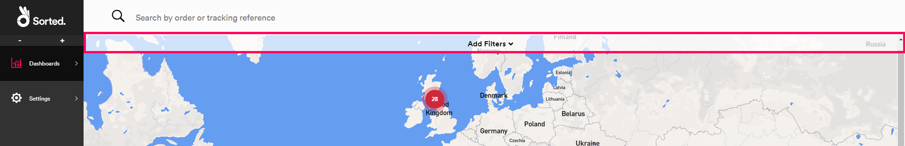

   The **Filters** panel is displayed.

   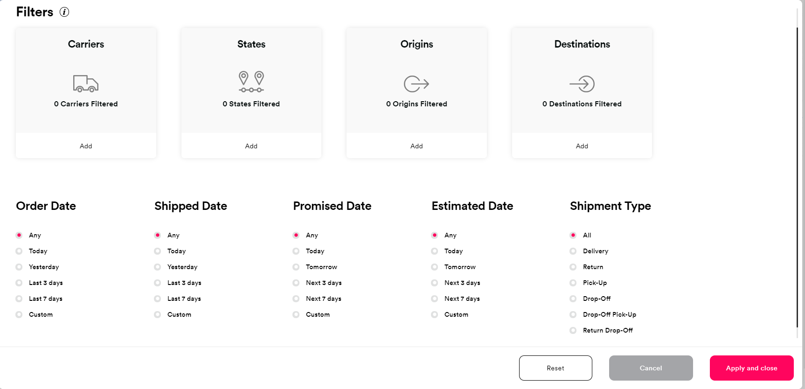    

2. Select the filters you want to apply:
   * The **Carriers**, **States**, **Origins**, and **Destinations** filters use a search page. To add these filters, click **Add** on the relevant tile to display a list of available options, then select the options you require from the list. You can select multiple options if required.
       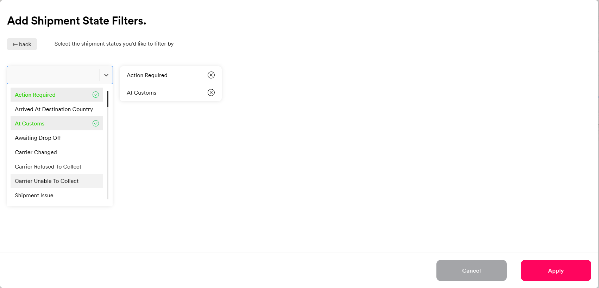 
     
       Selected options are displayed in the right-hand column. To deselect an option, click on it.

       > [!NOTE]
       >
       > The **Carriers** list only displays those carriers for which you have an active carrier connector.

   * To select dates and **Shipment Type**s, select the required option using the radio buttons.
3. Click **Apply and close** to apply your changes and return to the dashboard. REACT will now display only those shipments that meet your criteria. 

Active filters appear on the **Active Filters** toolbar.

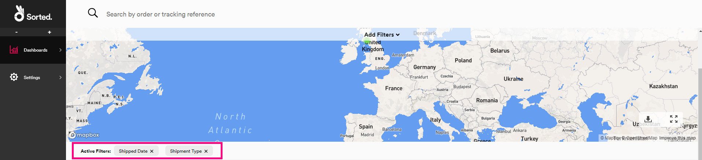 

To deselect a filter from the **Active Filters** toolbar, click the filter's **x** button.

## User Access

All REACT users can view the **States** and **All Shipments** pages, and view, edit and delete shipment notes.

## Next Steps

Learn more about the REACT UI:

* [Managing Webhooks](/react/help/managing-webhooks.html)
* [Settings](/react/help/settings.html)
* [User Management](/react/help/user-management.html)