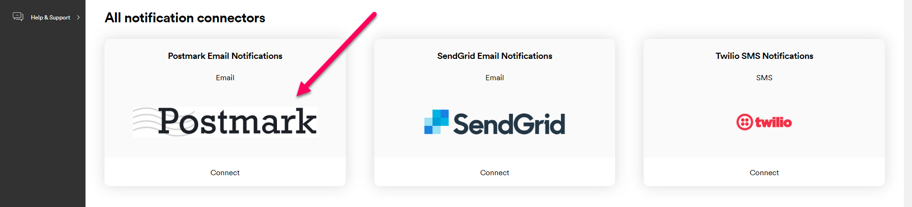
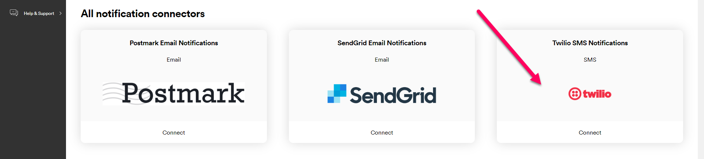
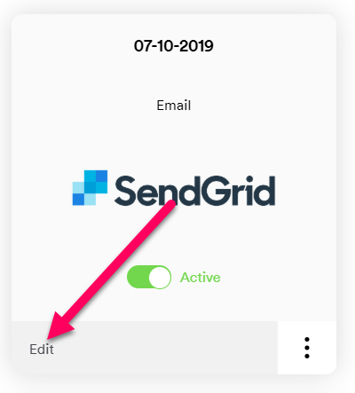

# Configuring Notifications

REACT's **Notifications Info** UI page enables you to set up automated email and SMS delivery notifications for your customers without any development work. To configure notifications, you'll need to set up an account with one of REACT's compatible email or SMS providers, give REACT your account details, and configure the details of the notification itself.  

---

## Notifications Overview

The REACT notification centre has three components:

* **Notification Connectors** store the technical details REACT uses to send emails and SMS messages, including send-from addresses and account details for third party providers. All REACT notifications are powered by a notification connector.
* **Notification Templates** define the content of your notification. These can either be set up via a third-party provider, or (in the case of REACT and Postmark notifications) edited from within the REACT UI via the **Notification Templates** page. 
* **Notifications** are the individual messages sent to customers. When you set up a notification, you define the connector that will power it, the template it should use, and define when the notification should be sent.

## Setting up Notification Connectors

The first step in setting up REACT notifications is to create a notification connector. You can set up connectors for your existing [Postmark](https://postmarkapp.com/) (email), [Twilio](https://www.twilio.com/) (SMS), and [SendGrid](https://sendgrid.com/) (email) accounts. Alternatively, you can set up a REACT connector, which enables you to send emails without the need for a third-party service.

> <span class="note-header">Note:</span>
>
> Before you can set up a notification connector to a third-party service, you'll need to set up an account with the relevant provider and have your details to hand. This section explains the information you need to set up a connector to each of the providers.

To set up a new connector, select **Settings > Notification Centre > Notification Connectors**, scroll down to the **All Notification Connectors**, and click **Connect** on the connector you want to set up. See below for specific information on each provider.

Once you have set a connector up, its tile moves to the **Existing Connectors** section of the **Notification Connectors** page.

### REACT

REACT connectors enable you to send emails without the need for a third-party service. To set up a REACT connector: 

1. Select **Settings > Notification Centre > Notification Connectors** and click **Connect** on the **REACT Email Notifications** connector. 
    
       

    REACT displays the **REACT Email Notifications Connection** tile.

       

2. Enter a **Name** for your connection.
3. Enter the **Email Address** you want to send emails from. 

    If you use an email associated with your own domain then you will need to verify that domain once the connector has been set up. Alternatively, you can use a `@react.sorted.com` address, which does not require domain verification.
4. Enter the sender **Display Name** you want to use in your sent emails.
5. Click **Save** to create the connector and return to the **Notification Connectors** page.

**Verifying Custom Domains**

If you entered an address from a custom domain into the **Email Address** field, then you will need to verify that domain before you can use the new connector. Verifying your domain enables REACT to confirm that you own the domain you want to send emails from. 

To verify your domain:

1. Click the context menu on the tile and then click **Verify**.

       

    REACT displays the **Domain Verification** dialog.

    

2. Make a note of the values in the **DKIM Host** and **DKIM Text** fields.
3. Create a new TXT DNS record on your domain, where Name = DKIM Host and Value = DKIM Text.

> <span class="note-header">Note:</span>
> For information on creating TXT DNS records, see your domain host's documentation.

4. In the REACT UI, click the **Verify** button to verify your domain. REACT checks the domain and indicates whether the domain was successfully verified.

> <span class="note-header">Note:</span>
> It may take up to 48 hours for the DNS record you created to become verifiable. You can **Cancel** the dialog and return to complete the verification later if required.

### Postmark

Before you can set up a connector to Postmark, you'll need to do the following:

1. Go the the [Postmark](https://postmarkapp.com/) site and set up an account.
2. Add Sender Signatures or Verified Domains. In order to send emails via Postmark you'll need to have a Sender Signature set up for each email address you want to send from. Alternatively, you can verify all addresses in a particular domain by setting up a Verified Domain.

    > <span class="note-header">More Information: </span>
    >
    > For more information on setting up Sender Signatures, see [this page](https://postmarkapp.com/support/article/846-how-can-i-send-on-behalf-of-my-users) of the Postmark documentation.
    >
    > For more information on setting up Verified Domains, see [this page](https://postmarkapp.com/support/article/1046-how-do-i-verify-a-domain) of the Postmark documentation.

3. Set up Postmark email templates. Any templates you set up will automatically be made available to select when you set up notifications in REACT.

    > <span class="note-header">More Information: </span>
    >
    > For more information on configuring Postmark email templates, see [Postmark's documentation](https://postmarkapp.com/support/sending-emails#templates)

4.  Make a note of your Postmark server API token. You can view your server API token by logging in to Postmark and selecting **Servers > [your server] > API Tokens**. 

   

You're now ready to set up a Postmark connector. To do so: 

1. Select **Settings > Notification Centre > Notification Connectors** and click **Connect** on the **Postmark Email Notifications** connector. 
    
       
    
    REACT displays the **Postmark Email Notifications Connection** tile.

     

2. Enter a **Name** for your connection.
3. Enter the **Server Token** for your Postmark account.
4. Enter the **Email Address** you want to send your email updates from. The address must either have a Sender Signature or be part of a Verified Domain.
5. Click **Save** to create the connector.

### SendGrid

Before you can set up a connector to SendGrid, you'll need to do the following:

1. Go the the [SendGrid](https://sendgrid.com) site and set up an account.
2. Verify your sender details.

    > <span class="note-header">More Information: </span>
    >
    > For more information on verifying your SendGrid sender details, see [SendGrid's documentation](https://sendgrid.com/docs/ui/account-and-settings/verifying-your-account/)

3. Set up SendGrid email templates. Any templates you set up are automatically made available to select when you set up notifications in REACT.

    > <span class="note-header">More Information: </span>
    >
    > For more information on configuring SendGrid email templates, see [SendGrid's documentation](https://sendgrid.com/docs/ui/sending-email/create-and-edit-legacy-transactional-templates/)

4. Set up a SendGrid API key with full access to the SendGrid service, and make a note of it. You'll need this information in order to set up a connector to SendGrid.

   

    > <span class="note-header">More Information: </span>
    >
    > You can only view your SendGrid API key immediately after creating it. For more information on setting up SendGrid API keys, see [SendGrid's documentation](https://sendgrid.com/docs/ui/account-and-settings/api-keys/)

You're now ready to set up a SendGrid connector. To do so: 

1. Select **Settings > Notification Centre > Notification Connectors** and click **Connect** on the **SendGrid Email Notifications** connector. 
    
       
    
    REACT displays the **SendGrid Email Notifications Connection** tile.

     

2. Enter a **Name** for your connection.
3. Enter the **API Key** for your SendGrid account.
4. Enter the **Email Address** of your SendGrid account.
5. Click **Save** to create the connector.

### Twilio

Before you can set up a connector to Twilio, you'll need to do the following:

1. Go to the [Twilio](https://www.twilio.com/) site and sign up for an account.
2. Create a Twilio messaging service.

    > <span class="note-header">More Information: </span>
    >
    > For more information on creating Twilio messaging services, see [Twilio's documentation](https://www.twilio.com/docs/notify/quickstart/sms#create-a-messaging-service)

3. Make a note of your Twilio **Account SID** and **Auth Token**.

       

    > <span class="note-header">More Information: </span>
    >
    > For more information on obtaining your Twilio authentiication details, see [Twilio's documentation](https://support.twilio.com/hc/en-us/articles/223136027-Auth-Tokens-and-How-to-Change-Them)

You're now ready to set up a Twilio connector. To do so:

1. Select **Settings > Notification Centre > Notification Connectors** and click **Connect** on the **Twilio SMS Notifications** connector. 
    
       
    
    REACT displays the **Twilio SMS Notifications Connection** tile.

     

2. Enter a **Name** for your connection.
3. Enter the **Account SID** and **Auth Token** for your Twilio account.
4. Enter the **Phone Number** you want to send your SMS updates from. This must be a registered Twilio phone number.
5. Click **Save** to create the connector.

### Managing Existing Connectors

**Editing Existing Notification Connectors**

To edit an existing notification connector, open the **Settings > Notification Centre > Notification Connectors** UI page and click **Edit** on the connector you want to edit.

    

REACT displays the **Edit Notification Connection** page for that connector. Make the required edits and click **Save** to save your changes.

**Deactivating Existing Notification Connectors**

To deactivate an existing notification connector, open the **Settings > Notification Centre > Notification Connectors** UI page and click the **Active** toggle on the connector's tile. 

     

The toggle switches to the **Inactive** position, confirming that the connector has been deactivated. 

Deactivating a notification connector means that REACT can no longer retrieve data from that provider. However, its configuration is saved, and the connector can be reactivated by clicking the toggle again.

**Disconnecting Existing Notification Connectors**

To permanently disconnect a connector, open the **Settings > Notification Centre > Notification Connectors** UI page and click the **Disconnect** button on the connector's tile.

    

A confirmation dialog is displayed. Click **Yes** to disconnect the connector.

Disconnecting a notification connector deactivates it and deletes all of its configuration. To reinstate a disconnected notification connector you would need to set it up again as a new connector.

## Creating Notification Templates

The **Notification Templates** page enables you to create HTML email templates to use with your REACT and Postmark connectors. Email templates define the content of the emails you send. You can add personalised customer details, such as names and tracking links, to your templates using merge tags.

To create a new notification template:

1. Open the **Settings > Notification Centre > Notification Templates** UI page and click **Create New Template**.
       
     
    
    The **Create Template** page is displayed.

     

2. Enter a **Name** for the template. Names are used to identify the template in the REACT UI.
3. Enter a **Subject** for the template. This is the subject line that the sent emails will use.
4. Select the **Notification Connector** that the template is to be associated with.
5. Enter your email content into the **HTML** dialog box. You can use standard HTML and internal CSS. 
6. Click **Save** to save your changes and return to the **Notification Templates** page. The template you set up is now displayed on the page. When you set up a notification using the connector you selected in Step 3, your template is available in the **Select Email Template** list.

To preview your new template, click the option menu on the template's tile and select **Preview**. Use the buttons at the top of the page to choose between previewing your template in desktop and mobile views.

 

### Using Merge Tags

Merge tags enable you to personalise the notifications sent out to customers. For example, you might want to insert a customer's name or address details into the text and email sent to them,  rather than sending a generic message. 

A merge tag is a snippet of JSON that denotes the data that should be inserted into a notification, and where that data should be inserted. To use a merge tag, simply add the relevant field or fields to the text of your notification. For emails, you will need to do so in the relevant template (i.e. via the SendGrid / Postmark UI or the **Notification Templates** REACT UI page, as applicable). For SMS notifications, you would insert your merge tags into the REACT UI's **Enter Text for SMS** field.

The full merge tag structure is:

```json
{
 "Consumer": {
   "Reference": "Reference",
   "Email": "Email",
   "Phone": "Phone",
   "MobilePhone": "MobilePhone",
   "FirstName": "FirstName",
   "LastName": "LastName",
   "MiddleName": "MiddleName",
   "Title": "Title"
 },
 "TrackingPageUrl": "TrackingPageUrl",
 "Key1": "Value1",
 "Key2": "Value2"
}
```

In practice, you would likely use merge tags one field at a time, rather than as a single JSON object. For example, you might enter the following example as notification text:

Hi `{{Consumer.FirstName}}`! Your package is on its way. To keep an eye on it, go to `{{TrackingPageUrl}}`.

> <span class="note-header">Note:</span>
>
> When configuring Twilio notifications, the `TrackingPageUrl` property _only_ requires triple curly brackets, rather than the standard double curly brackets. For Twilio, you would need to enter the above example as:
>
> Hi `{{Consumer.FirstName}}`! Your package is on its way. To keep an eye on it, go to `{{{TrackingPageUrl}}}`.

The metadata keys at the bottom enable you to further customise the information available in your notifications by adding metadata from your shipments. For example, supposed that you register a shipment with a `Contents` metadata property, which you use to supply a description of the shipment contents, as follows:

```json
      "metadata": [
        {
          "key": "Contents",
          "value": "Shoes",
          "type": "String"
        },
      ],
```

You could then further enhance your notification by adding shipment contents to the text. For example:

Hi `{{Consumer.FirstName}}`! The package with your `{{Contents}}` in is on its way. To keep an eye on it, go to `{{TrackingPageUrl}}`.

> <span class="note-header">More Information:</span>
>
> Merge tags can only display information about a shipment if that shipment has the relevant information registered. In the example above, this would require you to register a customer's first name, and a `Contents` metadata property. 
>
> For more information on registering shipment data, including setting up metadata, see the [Registering Shipments](https://docs.sorted.com/react/registering-shipments/) page.

### Managing Existing Notification Templates

**Editing Existing Templates**

To edit an existing template, open the **Settings > Notification Centre > Notification Templates** UI page and click **Edit** on the template you want to edit.

 

REACT displays the **Edit Template** page. Make the required edits and click **Save** to save your changes.

**Deleting Templates**

To delete a template, open the **Settings > Notification Centre > Notification Templates** UI page, click the option menu on the relevant template, and click **Delete**.

 

REACT displays a confirmation dialog. Click **Yes** to delete the template.

## Creating Notifications

Once you've created your notification connectors, you're ready to configure your notifications themselves. When you create a notification, you tell REACT what connector you'd like to use, when REACT should send the notification, and what the content of the notification should be. If required, you can also include a link to a REACT tracking page within the notification.

REACT notifications are triggered by shipment filters. Each shipment filter contains a list of shipment states and calculated events. When a shipment enters once of the filter's states or events, REACT sends any notifications using that filter as a trigger.

For example, suppose that you want to send an SMS notification to your customers when their shipment is out for delivery but appears to be late. To do this, you would set up a shipment filter with the *Out For Delivery* state and *Late* calculated event selected, and then create a Twilio notification with that filter selected as the notification's trigger.  

To create a new notification:

1. Select **Settings > Notification Centre > Notification Set Up** to display the **Notification Set Up** page.

     

2. Click the **Add New Communication** tile. REACT displays a list of available connectors.

    

3. Select the connector you want to use for the notification, and then click **Next** to display editable fields relating to notification details.

        

4. Enter a **Name** for the notification.
5. Select the **Shipment Filter** that you want to use as a trigger for the notification.
    > <span class="note-header">Note:</span>
    >
    > If you have not yet created the shipment filter you want to use, click **Create Shipment Filter**. REACT redirects you to the **Create & Manage Shipment Filters** page. When you have set your shipment filter up, return to the **Settings > Notification Centre > Notification Set Up** page to configure your notification. 
6. Enter your notification content. This step differs depending on whether you are setting up SMS or email notifications:
    * If you are setting up email notifications, select the email template you want to use from the **Select Email Template** drop-down list. 

        ><span class="note-header">Note:</span>
        >
        > * For REACT notifications, this list displays the templates you have configured for the selected connector on the **Notification Templates** UI page. 
        > * For SendGrid notifications, the list is automatically populated using the templates you have set up in SendGrid. 
        > * For Postmark notifications, the list displays both templates configured in Postmark and templates configured in the REACT UI.
    
      

    * If you are setting up Twilio SMS notifications, enter the text of your SMS into the **Enter Text for SMS** field.

     

    > <span class="note-header">Note:</span>
    >
    > Merge tags enable you to inject specific customer details such as names and addresses into your notifications. For more information on merge tags, see the [Using Merge Tags](#using-merge-tags) section. 

7. If required, select a REACT tracking page from the **Select Tracking Page** drop-down list. If you select a tracking page, then REACT will insert a tracking link into the notification.
    > <span class="note-header">More Information:</span>
    >
    > For more information on setting up REACT tracking pages, see the [Creating Tracking Pages](https://docs.sorted.com/react/tracking-pages/) page.
8. If you want to activate the notification immediately after saving, select the **Activate This Notification** check box.

    If you want to save the notification without activating it, leave the **Activate This Notification** check box unselected.
9. Click **Save** to save the notification.

### Managing Existing Notifications

**Editing Existing Notifications**

To edit an existing notification, open the **Settings > Notification Centre > Notification Set Up** UI page and click **Edit** on the notification you want to edit.

    

REACT displays the **Edit Notification** page for that notification. Make the required edits and click **Save** to save your changes.

**Deactivating Existing Notifications**

To deactivate an existing notification, open the **Settings > Notification Centre > Notification Set Up** UI page and click the **Active** toggle on the notification's tile. The toggle switches to the **Inactive** position, confirming that the notification has been deactivated. 

    

Deactivating a notification means that REACT will no longer send it, even if shipments meet the criteria set out in its shipment filter. However, its configuration is saved, and the notification can be reactivated by clicking the toggle again.

**Disconnecting Existing Notifications**

To permanently disconnect a notification, open the **Settings > Notification Centre > Notification Set Up** UI page and click the **Disconnect** button on the notification's tile.

    

A confirmation dialog is displayed. Click **Yes** to disconnect the notification.

Disconnecting a notification deactivates it and deletes all of its configuration. To reinstate a disconnected notification you would need to set it up again.

## Next Steps

Read on for more info:

* [REACT Overview](https://docs.sorted.com/react/overview/)
* [Registering Shipments](https://docs.sorted.com/react/registering-shipments/)
* [Managing Webhooks](https://docs.sorted.com/react/managing-webhooks/)
* [Retrieving Shipment and Event Data](https://docs.sorted.com/react/retrieving-data/)