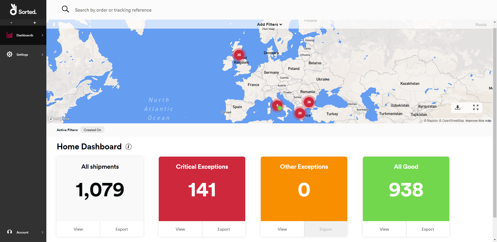

# REACT Overview

Welcome to SortedREACT! Here you'll find a brief overview of REACT's component parts and what you can do with them.

If you just want to get started with the system, check out the [Quick Start](/react/help/quick-start.html) guide.

---

## Introduction to REACT

REACT aggregates all your tracking information in one place and one format, no matter where your shipments are going or what carrier they're shipping with. Once you register your shipments and give REACT permission to access tracking data from your carriers, REACT automatically watches out for updates and keeps all your shipment records up to date. 

This standardised tracking data enables you to build API-driven tracking pages on your sites, use webhooks to set up automated delivery alerts to your consumers or customer service teams, and monitor shipment performance via REACT's UI dashboard.  

### How REACT Works

REACT is based around three fundamental concepts: shipments, tracking events, and events.

* A **shipment** is a singly-tracked consignment of goods that are being shipped together from a single origin location to a single destination location.
* A **tracking event** is a shipment progress update received from a carrier. REACT converts carrier updates into a standard form, meaning that tracking events are always consistent no matter which carrier you ship with.
* A REACT **event** gives details of a shipment property change. For example, an address change to a particular shipment would be represented as an event. Events can be triggered by tracking events.

### The Shipment Lifecycle

A typical REACT shipment lifecycle might look something like this:

  

<!-- This dodgy hack is necessary because Gatsby ignores any classes you apply to images themselves, apparently -->

1. A shipment is registered for tracking in REACT. You can register shipments via either the [Register Shipments](https://docs.sorted.com/react/api/#RegisterShipments) API endpoint or REACT's SFTP upload service. 

   > More Information:
   > For more information on registering shipments, see the [Registering Shipments](/react/help/registering-shipments.html) page.
2. REACT continually checks its carrier data for new tracking events relating to the shipment. You'll need to set up carrier connectors via the **Settings > Carrier Connectors** UI page to give REACT access to your tracking information.
3. Where REACT finds new tracking information, it analyses the tracking event sent by the carrier and uses it to determine the shipment's current state.  
   
   REACT uses internal, standardised shipment states for all carriers. For example, our analysis has shown that DPD UK’s tracking events with a status of *Collected* and Yodel tracking events with a status of *Parcel Picked Up* mean the same thing. As such, REACT converts both of these statuses to an internal REACT shipment state of *Collected By Carrier*, making it easier to track and manage your shipments no matter which carrier they're with. This process takes place for every tracking event received from REACT's supported carriers. 

   You can also customise the names used for REACT shipment states via the UI’s **Settings > Custom State Labels** page. For example. you could rename the *Collected By Carrier* REACT shipment state to *With Our Providers*. State labels enable you to communicate tracking information to your customers in your brand's tone of voice or in an alternative language. REACT state labels support up to 8 locales.

   > More Information:
   > For a full list of available REACT shipment states, see the [Shipment States](/react/help/shipment-states.html) page.
4. REACT converts the contents of the carrier's tracking update into a standardised REACT tracking event, and associates the contents of that event with the relevant shipment, based on the shipment's carrier tracking reference. If two or more shipments have the same carrier tracking reference, then REACT associates the tracking event with all relevant shipments.

   > More Information:
   > For information on the structure of REACT's tracking events, see the [Get Tracking Events](https://docs.sorted.com/react/api/#GetTrackingEvents) API reference.
5. If a shipment's properties need to be updated as a result of the tracking event (for example, because the shipment's state or promised date have changed), then REACT creates an internal event and updates the shipment's details accordingly. 

   > More Information:
   >For more information on the structure of REACT's Event objects, see the [Get Event](https://docs.sorted.com/react/api/#GetEvent) API reference.
6. If the change in shipment properties has triggered any of your webhooks (for example, because you have a webhook set up to listen out for failed deliveries and the shipment's state has changed to *Delivery Failed Card Left*), then REACT sends the shipment's data to you. 

   > More Information:
   >For more information on setting up webhooks, see the [Managing Webhooks](/react/help/managing-webhooks.html) page.
7. You can use the webhook data REACT sends to drive services that send automated email, SMS, push, or social media notifications to your customers.
8. You can also use REACT's webhook data to build services that automatically escalate issues to your carriers or create tickets for your customer service team to manage.
9. You can use the data from REACT's APIs to drive embedded delivery tracking from your own website, without the need to pass customers off to a carrier portal.

   > More Information:
   >For more information on retrieving tracking data from REACT, see the [Retrieving Shipment and Event Data](/react/help/retrieving-data.html) page.

## REACT Components

REACT is designed to be flexible, enabling you to manage and track shipments in a variety of ways. You can interact with REACT via:

* **APIs** - REACT's APIs let you register and maintain your shipment data, and retrieve tracking information. 
* **Webhooks** - REACT uses webhooks to notify you of shipping events proactively. Whenever a shipment enters a selected state, REACT will send that shipment's data to you.
* **UI** - The REACT dashboard gives you advanced shipment monitoring features, and enables administrators to configure the system.
* **SFTP** - If required, you can upload shipment details to REACT via file transfer instead of the API.

## Integrating with REACT

REACT offers the following API endpoints, enabling you to offer advanced shipment tracking and management features through your own website or apps:

| Endpoint                                                                                               | Purpose                                                        |
| ------------------------------------------------------------------------------------------------------ | -------------------------------------------------------------- |
| [Register Shipments](https://docs.sorted.com/react/api/#RegisterShipments)                             | Register shipments for tracking                                |
| [Get Shipment by Shipment ID](https://docs.sorted.com/react/api/#GetShipmentbyShipmentID)              | Retrieve shipment details by REACT Shipment ID                 |
| [Get Shipments](https://docs.sorted.com/react/api/#GetShipments)                                       | Retrieve shipment details by tracking or custom reference      |
| [Update Shipment](https://docs.sorted.com/react/api/#UpdateShipment)                                   | Update shipment details                                        |
| [Delete Shipment](https://docs.sorted.com/react/api/#DeleteShipment)                                   | Delete a shipment                                              |
| [Get Tracking Events by Shipment ID](https://docs.sorted.com/react/api/#GetTrackingEventsbyShipmentID) | Retrieve all shipment tracking events for a specified shipment |
| [Get Event](https://docs.sorted.com/react/api/#GetEvent)                                               | Retrieve events by REACT Event ID                              |
| [Get Shipment Events](https://docs.sorted.com/react/api/#GetShipmentEvents)                            | Retrieve events by date range, references and carrier          |
| [Get Shipment Events by Shipment ID](https://docs.sorted.com/react/api/#GetShipmentEventsbyShipmentID) | Retrieve event details by REACT Shipment ID                    |
| [Get Shipment States History](https://docs.sorted.com/react/api/#GetShipmentStatesHistory)             | Retrieve a shipment's shipment state history                   |

To query any of the APIs, you'll need an API key. You can create one from the **Settings > API Keys** tab in the REACT UI. You'll also need to make sure your `accept` and `content-type` headers are set to `application/json`, as REACT only works with JSON data.

>  More information:
>
> * For full request and response details for each endpoint, see the [API Reference](https://docs.sorted.com/react/api).
> * For information on how to register shipment details via API and SFTP, see the [Registering Shipments](/react/help/registering-shipments.html) page.
> * For information on retrieving shipment, event, and tracking information via API, see the [Retrieving Shipment and Event Data](/react/help/retrieving-data.html) page.
> * For information on updating shipment details via API, see the [Updating Shipments](/react/help/updating-shipments.html) page.
> * For information on the error codes that REACT's APIs can return, see the [Error Codes](/react/help/error-codes.html) page. 

## Webhooks and Shipment Filters

REACT's webhooks enable you to build services that respond to shipping events proactively. During the webhook setup process, you associate a particular webhook with a set of conditions. When an event puts a particular shipment into one of those conditions, REACT sends details of the event and its associated shipment to a URL of your choice. You can then feed this data into whatever application you choose.

Webhooks can be configured from the **Settings > Webhooks** tab on the REACT Dashboard. The settings you select on this page depend on the service that is to receive the webhook data. You'll need to know:

* The URL to send the data to.
* Whether the webhook needs to send using a POST or PUT method.
* The authentication details for the service that will receive the webhook.
* Whether the request should use any additional headers.

In REACT, webhooks are triggered by shipment filters. A shipment filter is a list of shipment states, tags, and calculated events that acts as a webhook trigger. When a shipment meets any of these criteria, any webhooks configured for that filter will deploy. Each webhook can be triggered by multiple shipment filters, and each shipment filter can be associated with multiple webhooks. 

You can create shipment filters from the **Settings > Shipment Filters** tab on the REACT Dashboard.

> More Information:
>
> For more information on creating and maintaining Shipment Filters and webhooks, see the [Managing Webhooks](/react/help/managing-webhooks.html) page.

## UI

The UI gives REACT admins an intuitive set of tools with which to monitor shipments and configure system operation. It has three main functions - **Reporting**, **Configuration**, and **User Management**. 

You can access the REACT UI [here](https://app.sorted.com/login). It is compatible with the latest versions of Microsoft Edge, Chrome, Firefox and Opera.

### Reporting

REACT's dashboards can be found under the UI's **Dashboard** tab. They give you a filterable overview of your registered shipments and system connectivity.

* **Shipment States** - Shows how many of your shipments are in red, amber, or green status at any given time, and enables you to plot those shipments on a map. Where required, you can drill down to view information on individual shipments or shipment states.
* **Performance** - Shows statistics on shipment performance by country.

> More Information:
>
> For more information on monitoring shipments in the UI, see the [Monitoring Shipments](/react/help/monitoring-shipments.html) page.

### Configuration

The UI's **Settings** tab enables you to configure REACT to receive carrier tracking information, set up webhooks and API keys, and configure connectivity to third-party products.

* **API Keys** - Enables you to set up new API keys and revoke existing keys where required.
* **Shipment State Labels** - Enables you to set up custom labels for REACT shipment states. Setting up custom labels helps you to communicate shipment updates to your customers using your own brand tone of voice.
* **Carrier Connectors** - Enables you to manage your existing carrier connectors and set up new ones where required. When you set up a connector for a particular carrier, you give REACT permission to receive tracking events from that carrier on your behalf.
* **Shipment Filters** - Enables you to manage your existing shipment filters and set up new ones where required.
* **Webhooks** - Enables you to manage authentication and payload details for your existing webhooks, associate webhooks with shipment filters, and set up new webhooks where required.

> More Information:
>
> For more information on configuring REACT in the UI, see the [Settings](/react/help/settings.html) page.

### User Management

Administrators can manage the REACT users in their team from the **Add Member** page, accessed from the user menu icon.

From this screen, as an Administrator, you can:

* Add team members. You'll need to give a name and email address. Once you send the invite, REACT sends an email to the user containing a link that can be used to activate the account and set up a password. 
* View details of existing REACT users in your team, as well as people you have invited but who have not yet signed up.
* Re-send invitation emails to pending users.
* Delete existing and pending users.

> More Information:
>
> For more information on managing users in the UI, see the [User Management](/react/help/user-management.html) page.

## Next Steps

Learn more about REACT:

* [Quick Start](/react/help/quick-start.html)
* [Registering Shipments](/react/help/registering-shipments.html)
* [Managing Webhooks](/react/help/managing-webhooks.html)
* [Retrieving Shipment and Event Data](/react/help/retrieving-data.html)