# Quick Start

Ready to get started with SortedREACT? This guide explains how to set up [real-time shipment tracking](#setting-up-tracking) and configure [shipment state monitoring](#setting-up-webhooks) via webhooks.

---
## Setting up Tracking

To track a shipment in REACT, you'll need to do the following:

1. <strong>Register the shipment.</strong> Registering a shipment lets REACT monitor tracking events in real time and enables you to use APIs to get updates on the shipment's progress.
2. <strong>Set up a carrier connector</strong> for each of the carriers you work with. Carrier connectors enable REACT to obtain tracking events.
3. <strong>Get the shipment's details.</strong> You can track shipments using the [Get Tracking Events by Shipment ID](https://docs.sorted.com/react/api/#GetTrackingEventsbyShipmentID) endpoint and the REACT UI.

### Registering a Shipment

You can give REACT details of the shipments you want to register using the **Register Shipments** endpoint. Like all REACT APIs, you'll need to generate an API key before you can talk to it.

**Getting an API Key**

To generate a new API key: 

1. Log into your REACT Dashboard and select **Settings > API Keys > Create New**.

   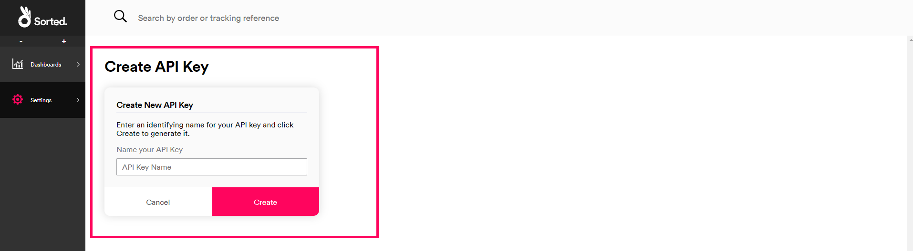

2. Enter an identifying name for the key, then click **Create**.

   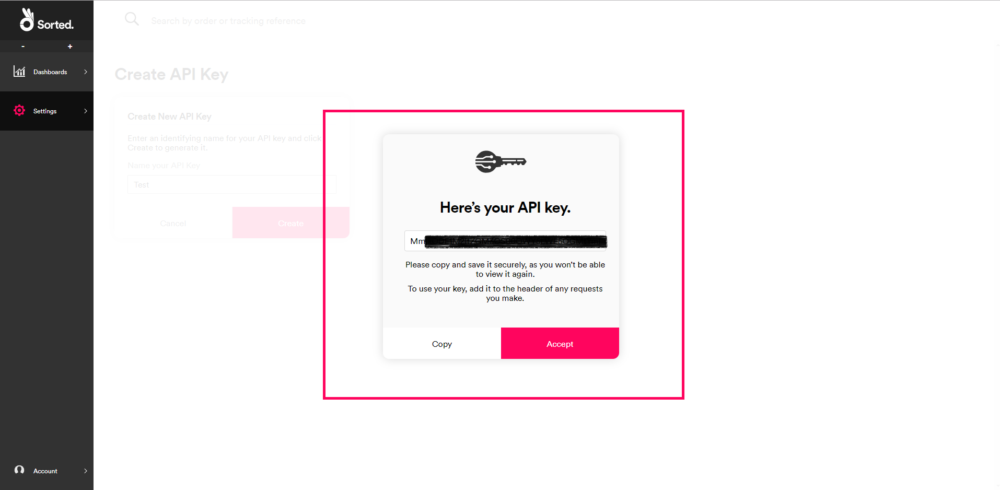

3. Copy your API key and save it somewhere safe.

   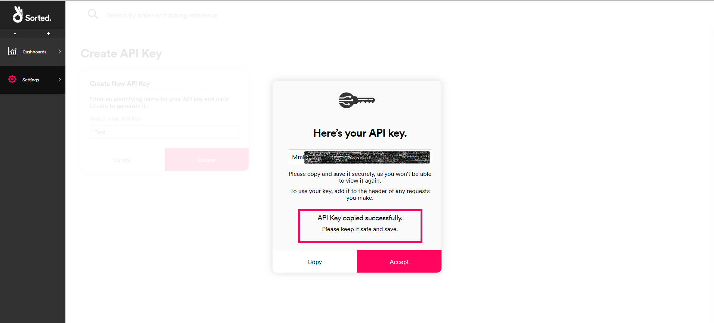

> <span class="note-header">Note:</span>
>
> It's really important that you make a note of your API key, as you can't come back and view it later.

You can use your key by adding an `x-api-key` header to any requests you make. This lets REACT know who you are, and makes sure only authorised people and applications can get at your data. The next section gives an example of a request header with an API key in place.

**Using the Register Shipments Endpoint**

To register a shipment, send a <span class="text--green text--bold">POST</span> request to the **Register Shipments** endpoint. As a minimum, you'll need to send the following information:

* The shipment's tracking reference. REACT will only accept one `tracking_reference` per shipment.
* JSON `Content-Type` and `Accept` headers. REACT works with JSON data.
* An `x-api-key` header with the API key you generated earlier as its value.

The full HTTP request for your new shipment should look something like this:

```json
POST /react/shipments HTTPS/1.1
Host: api.sorted.com
Accept: application/json
Content-Type: application/json
X-Api-Key: [your-api-key]
{
    "shipments": [{
        "tracking_references": ["TRACKING-DEMO-REFERENCE"]
    }]
}
```

<span class="text--caption text--center">Register Shipments request with tracking reference only.</span>

Once you've sent the request, REACT will return a <em>201</em> code and a [Shipment Created](https://docs.sorted.com/react/api/#RegisterShipments) response,
which contains some useful information about the Shipment resource produced. 

```json
  {
    "id": "sp_TRACKING-DEMO-ID",
    "message": "Shipment record 'sp_TRACKING-DEMO-ID' with tracking reference ["TRACKING-DEMO-REFERENCE"] registered successfully.",
    "tracking_references": [
      "TRACKING-DEMO-REFERENCE"
    ],
    "_links": [
      {
        "href": "https://api.sorted.com/react/shipments/sp_TRACKING-DEMO-ID",
        "rel": "self"
      }
    ]
  }
```

<span class="text--caption text--center">Successful Register Shipments response.</span>

The `id` is particularly important - this is a REACT-generated identifier for this shipment that can be used throughout REACT's APIs. 

> <span class="note-header">Tip:</span>
> 
> This example shows the simplest possible Register Shipments request - just a carrier tracking reference. The more data you give REACT when registering shipments, the more the system can do for you. You'll get much better information from webhooks and more flexible retrieval options, including the ability to track shipments via your own company reference. 
>
> For a full list of the properties REACT accepts when creating a shipment, check the [API Reference](https://docs.sorted.com/react/api/#RegisterShipments).
>
> For more information on registering shipments, see the [Registering Shipments](/react/help/registering-shipments.html) page.

### Setting up Carrier Connectors

When you set up a carrier connector, you'll need to give REACT your tracking credentials for that carrier.

To set up a carrier connector:

1. Log into your REACT Dashboard and select **Settings > Carrier Connectors** to display the **Carrier Connectors** page.

   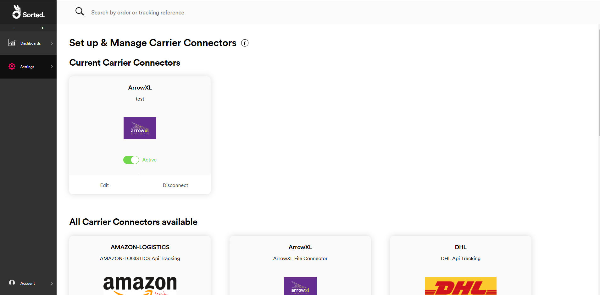

2. Select the carrier for which you want to set up a connector and follow the on-screen instructions to confirm your tracking details. The information required varies from carrier to carrier.

   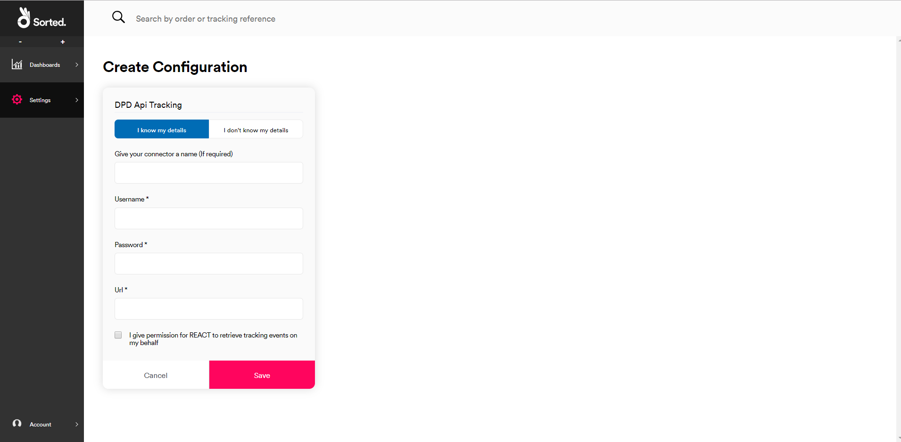

3. Select the check box to give REACT permission to retrieve tracking information and click **Save** to finish configuring the connector.

   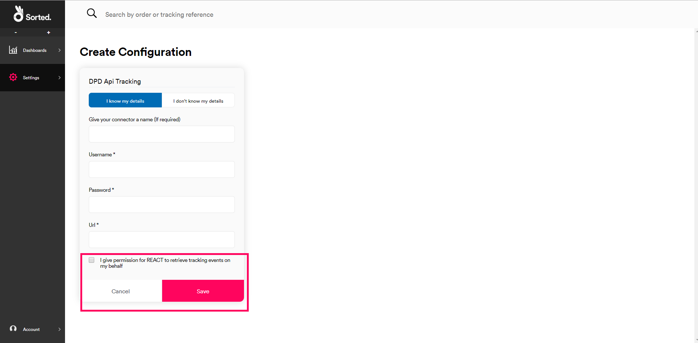

Once the connector is set up, REACT keeps you in the loop by automatically accessing tracking data for any registered shipments with that carrier. To enable and disable existing connectors, use the <strong>Active</strong> toggle on the connector's tile.

### Getting Tracking Events

Once you've registered your shipments, your customers will probably want to see how they're getting on. One way to track a shipment in REACT is via the [Get Tracking Events by Shipment ID](https://docs.sorted.com/react/api/#GetTrackingEventsbyShipmentID) endpoint. Send a <span class="text--blue text--bold">GET</span> request to `https://api.sorted.com/react/tracking/search?shipment_id={id}`, where `{id}` is the shipment `id` you obtained when registering the shipment. Don't forget to include your [API key](#registering-a-shipment).

This endpoint returns a [Shipment Tracking Events](https://docs.sorted.com/react/api/#GetTrackingEventsbyShipmentID) response, which includes an
array of all the tracking events that have been logged for that shipment. You can embed this data into your website or app, enabling you to serve real-time tracking information to your customers without directing them away from your site.

> <span class="note-header">More Information:</span>
>
> For more information on retrieving shipment and tracking data from REACT, see the [Retrieving Shipment and Event Data](/react/help/retrieving-data.html) page.

## Setting Up Webhooks

You can use webhooks to build automated shipment state monitoring functions within REACT. For example, you might want to automatically email your customer if a shipment falls into a particular state.

There are four steps to setting up webhooks. We covered the first two in the previous section.

1. Register the shipments you want to monitor. 
2. Set your carrier connectors up.
3. Use shipment filters to tell REACT which shipment states to trigger webhooks for.
4. Configure the webhook headers and target details.

In this example we'll use REACT to help build a service that sends an SMS to a customer when their shipment is delivered to a location other than their home address. We'll set REACT up so that every time a shipment falls into a state of **Delivered to Neighbour**, **Delivered to Reception** or **Delivered to Safe Location**, the system sends that shipment's event data to a URL you specified. You can then feed that data into your SMS gateway of choice.

### Configuring Shipment Filters

A shipment filter is a list of shipment states, calculated states, and/or shipment tags that acts as a webhook trigger. When a shipment meets any of these criteria, any webhooks configured for that filter will deploy.

In our example, we need to set up a shipment filter that includes the **Delivered To Neighbour**, **Delivered to Reception** and **Delivered to Safe Location** shipment states. To do that, you'll need to:

1. Log into your REACT Dashboard, select **Settings > Shipment Filters** and click **Create New**.

   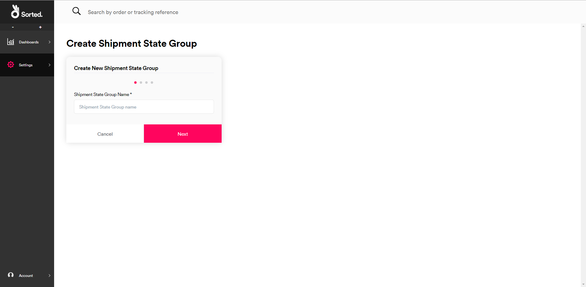

2. Give your filter a name and click **Next** to display list of available shipment states.

   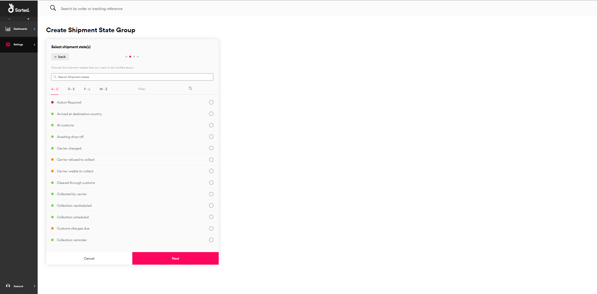

3. Select the **Delivered To Neighbour**, **Delivered to Reception** and **Delivered to Safe Location** shipment states from the list and click **Next**. A list of the states you selected is displayed.

   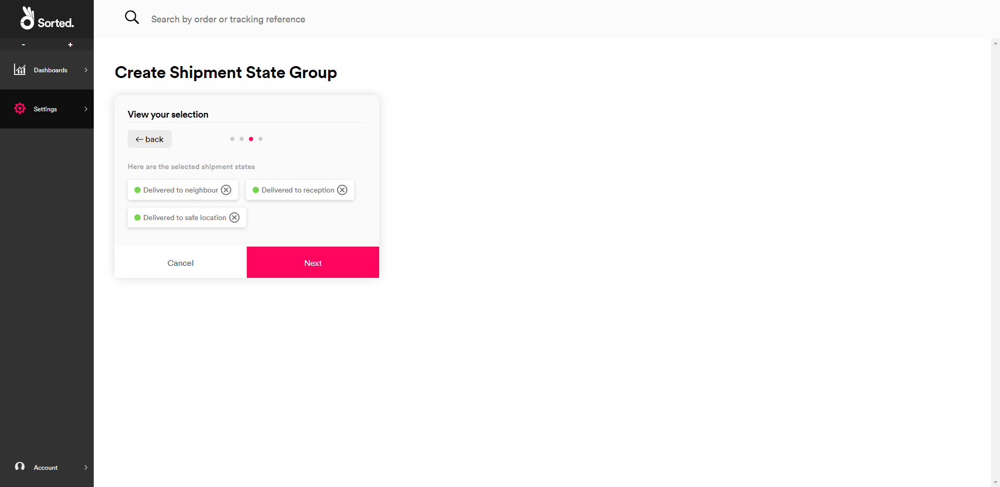

4. Click **Next** to display a list of shipment types.

   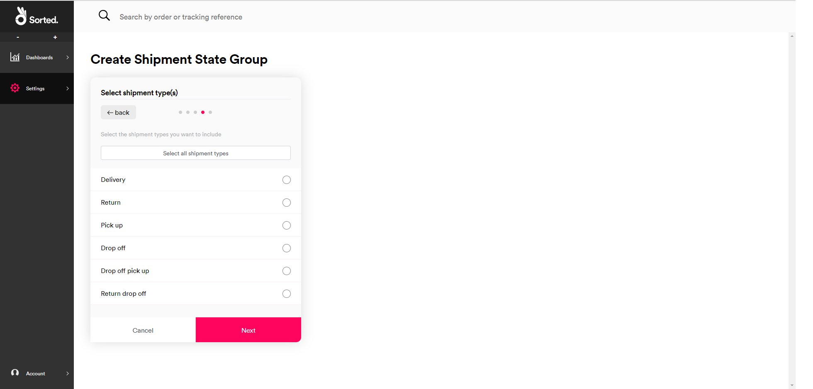

5. Select **Delivery** (this example only really applies to shipments that are being sent to the customer directly) and click **Next** to select tags.
   
   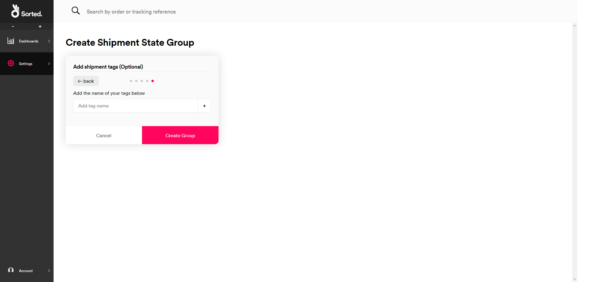

6. We don't need to select any tags in this example. Click **Create filter** to finish creating your shipment filter.

Whenever an outbound shipment assumes one of your selected states, it'll now fall into your new shipment filter.

### Configuring Webhooks

Now we have a shipment filter set up, we just need a webhook for it to trigger.

To set one up:

1. Log into your REACT Dashboard, select **Settings > Webhooks** and click **Create New**.

   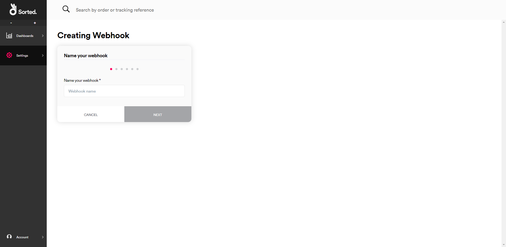

2. Give your webhook a name and click **Next** to select shipment filters.

   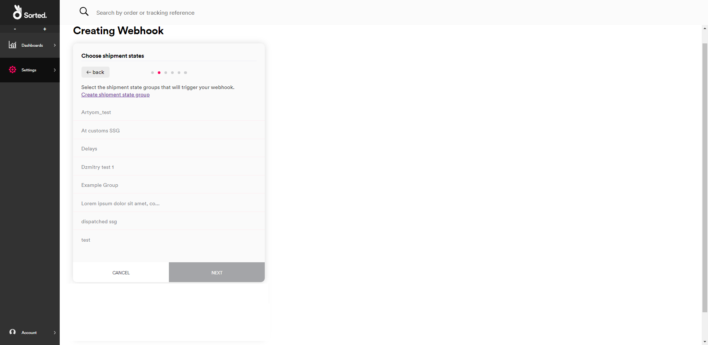

3. Select the shipment filter you created in the previous section and click **Next** to select shipping state label languages.

   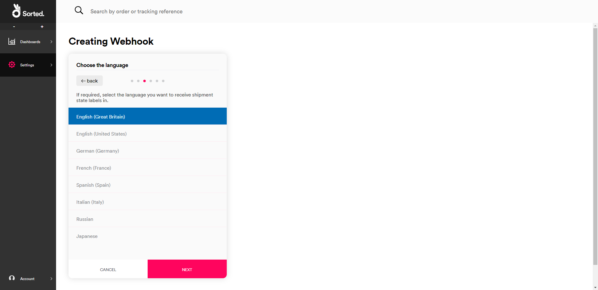

4. Select the language you want to receive shipping state labels in. The default is *English (Great Britain)*. Click **Next** to set up authentication.

   

5. Select the authentication method for the service you want the webhook to talk to (REACT currently supports Basic Auth, API Keys and JWT), and enter the relevant authentication details. Click **Next** to set up header details.

   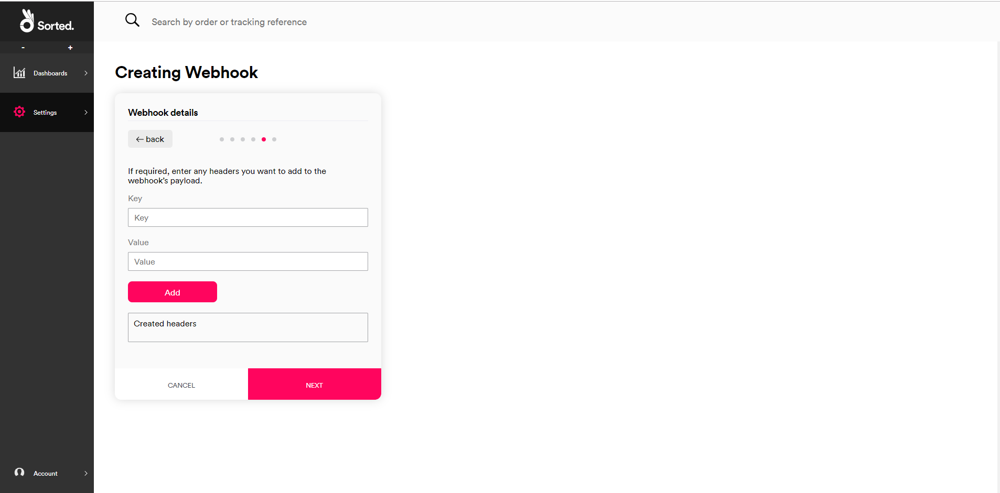

6. Enter any headers you want to append to the webhook payload by entering their **Key** and **Value** and clicking **Add**. When you've added any required headers, click **Next** to set up your webhook URL.

   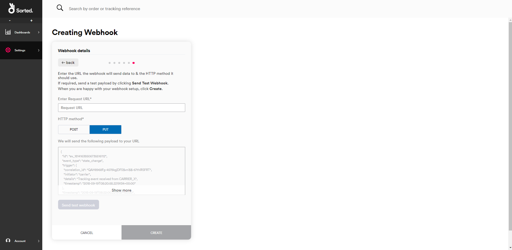

7. Enter the URL you want the webhook to send its payload to and select whether you want it to use a <span class="text--green text--bold">POST</span> or <span class="text--orange text--bold">PUT</span> HTTP method. If you need to, click **Send Test Webhook** to test your webhook configuration. The panel on the card shows what the payload will look like.

   > <span class="note-header">Note:</span>
   >
   >The body of the webhook payload is always the [Shipment Events](https://docs.sorted.com/react/api/#GetShipmentEvents) resource for the shipment that triggered the webhook.
8. When you're happy with your setup, click **Create** to create the webhook.

And we're done! Every time a shipment falls into a state of **Delivered To Neighbour**, **Delivered to Reception** or **Delivered to Safe Location**, REACT will send the [Shipment Events](https://docs.sorted.com/react/api/#GetShipmentEvents) resource for that shipment, along with any headers you configured, to the URL you specified.

The next steps are up to you. Following our example, you might integrate the webhook payload with your SMS gateway. However, you can use the data from REACT webhooks in any way you choose. The possibilities are limitless!

For more information on creating and maintaining shipment filters and webhooks, see the [Managing Webhooks](/react/help/managing-webhooks.html) page.

## Next Steps

We've barely scratched the surface of what you can do with REACT. Read on for more info:

* [REACT Overview](/react/help/overview.html)
* [Registering Shipments](/react/help/registering-shipments.html)
* [Managing Webhooks](/react/help/managing-webhooks.html)
* [Retrieving Shipment and Event Data](/react/help/retrieving-data.html)
