# Settings

This page explains how to use the pages in the REACT UI's **Settings** section to set up API keys, SFTP accounts, carrier connectors and custom state labels. 

> [!NOTE]
>
> The **Settings** section also features webhook and shipment filter setup pages. These pages are covered in detail on the [Managing Webhooks](/react/help/managing-webhooks.html) page.

---

## Setting up API Keys

API keys enable you to use REACT's APIs. If you attempt to make an API request without a valid API key then REACT returns a *401 Unauthorized* response. 

All REACT API keys offer access to all of REACT's API endpoints. For a full list of REACT's API endpoints, see the [API Reference](https://docs.sorted.com/react/api).

### Creating a New API Key

1. From the REACT dashboard, select **Settings > API Keys** to display the **Create & Manage API Keys** page.
  
   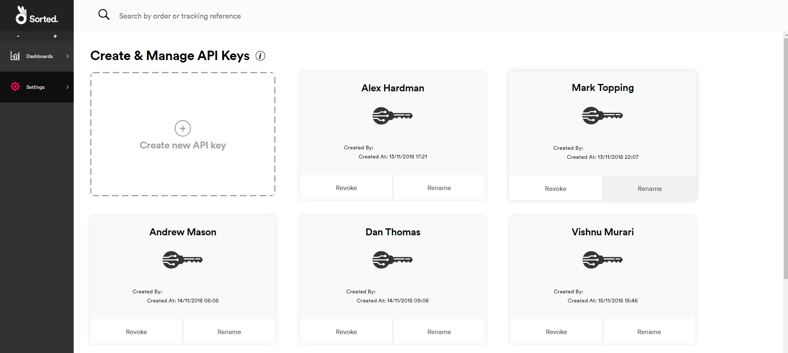

2. Click **Create new API key** to display the **Create New API Key** tile.

   

3. If required, enter a name for your API key into the **Name your API key** field. This step is optional, but highly recommended. Entering a name makes it easier to identify your key on the **Create & Manage API Keys** page.  
4. Click **Create**. REACT displays a dialog box with your API key in it.

   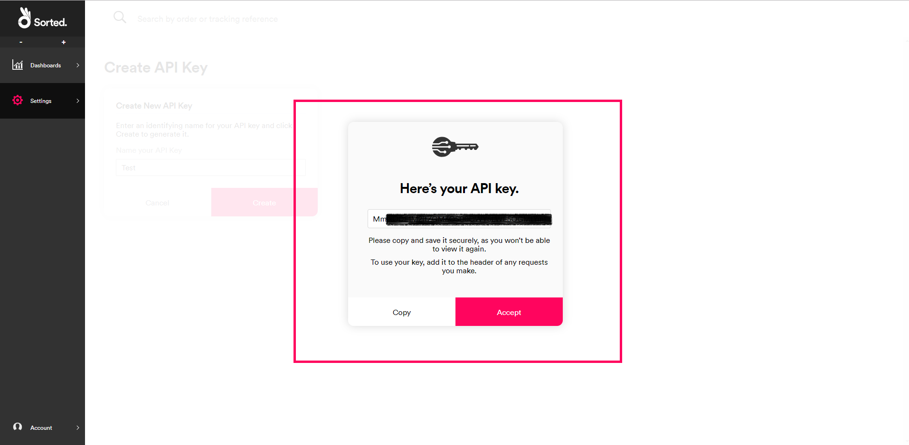

5. Click **Copy** to copy your API key to the clipboard. REACT displays a message when your key has been successfully copied.

   

   You should then paste the key into a secure file (that is, a file that can't be accessed by anyone who you wouldn't want to give you API key to).

> [!WARNING]
>
> It's *really important* that you make a note of your API key, as you can't come back and view it later.

To use your key, add an `x-api-key` header to any requests you make. This lets REACT know who you are, and makes sure that only authorised people and applications can get at your data. 

### Renaming API Keys

To rename an existing API key, open the **Settings > API Keys** UI page and click **Rename** on the key you want to rename.

   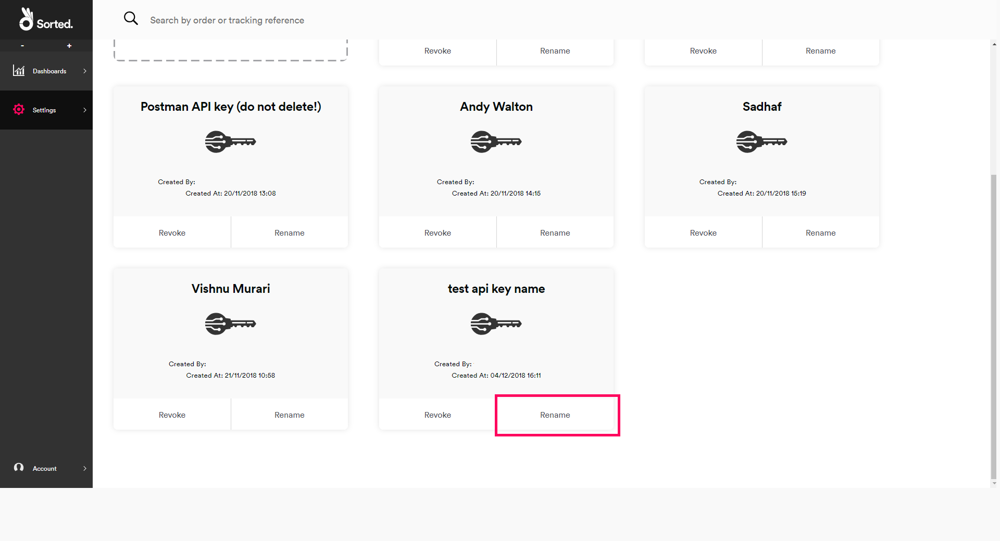

React displays the **Rename your API Key** tile. Enter a new name and click **Update** to rename the key.

   

Renaming an API key only changes that key's identifier on the **Create & Manage API Keys** page. It does not affect the key itself.

### Revoking Existing API Keys

To revoke an existing API key, open the **Settings > API Keys** UI page and click **Revoke** on the key you want to revoke.

   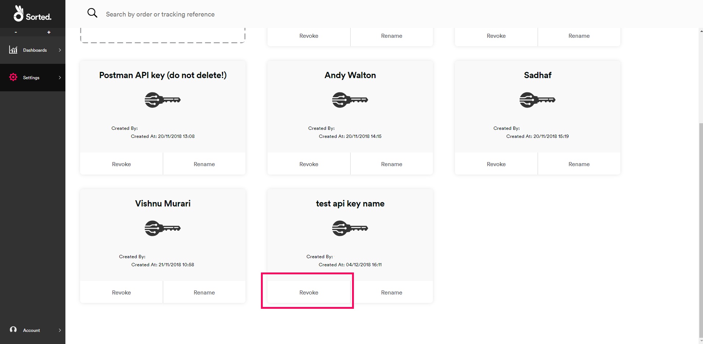

Click **Yes** on the confirmation dialog to revoke the key.

Revoking an API key deletes it permanently, and means that any API calls you have set up using that key will no longer work. If you attempt to send an API request using a key that has been revoked then REACT returns a *401 Unauthorized* response.

### User Access

Only Admin users can create and delete API keys.

## Setting up SFTP Accounts

Setting up a REACT SFTP account enables you to upload shipments via REACT's SFTP file upload service. 

To set up an SFTP account:

1. From the REACT dashboard, select **Settings > SFTP Account** to display the **Creating an SFTP Account** page.
   
   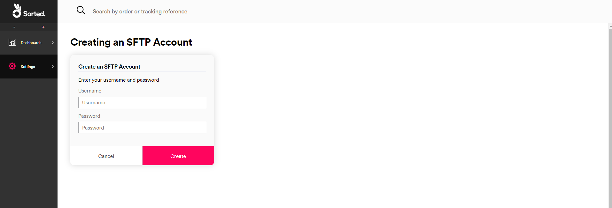

2. Enter a **Username** and **Password**. Your **Username** must have at least five characters and your **Password** must have at least eight characters.
3. Click **Create** to create the account. REACT displays your SFTP account's private key.

You should then copy and paste the key into a secure file (that is, a file that can't be accessed by anyone who you wouldn't want to give you API key to).

REACT only allows one SFTP account per organisation. If you attempt to create a second SFTP account, REACT displays an error.

> [!NOTE]
>
> For more information on uploading shipment data to REACT via SFTP, see the [Registering Shipments by SFTP](/react/help/registering-shipments.html#registering-shipments-by-sftp) section of the **Registering Shipments** page.

### User Access

Only Admin users can view, edit and delete SFTP accounts.

## Setting up Carrier Connectors

Carrier connectors enable REACT to obtain carrier tracking data. Setting up a connector for a particular carrier means that REACT can keep its records of that carrier's shipments up to date.

You must already have an account with the carrier in order to successfully set up a carrier connector. 

### Adding New Carrier Connectors

1. From the REACT UI, select **Settings > Carrier Connectors** to display the **Set Up & Manage Carrier Connectors** page.
   
   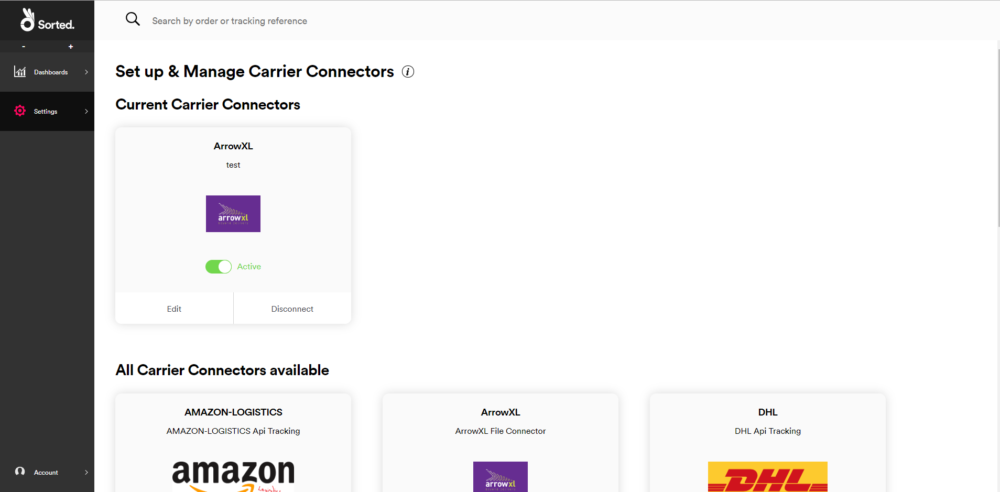

2. Click **Connect** on the tile of the carrier connector you want to set up. Available carrier connectors are displayed as tiles in the **All Carrier Connectors available** section of the screen.
    
    > [!NOTE]
    > Some carriers may display more than one connector. This is because, for these carriers, there are multiple integration methods that REACT can use to get the carrier's data. For example, a particular carrier may allow REACT to get data by API, file download, and web scraping. You should use whichever connection method your carrier account grants you access to.
   
   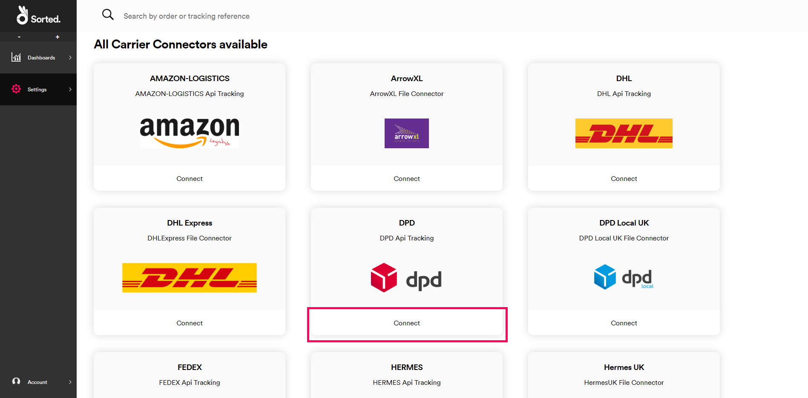
   
   REACT displays the **Create Configuration** page for that connector.
   
   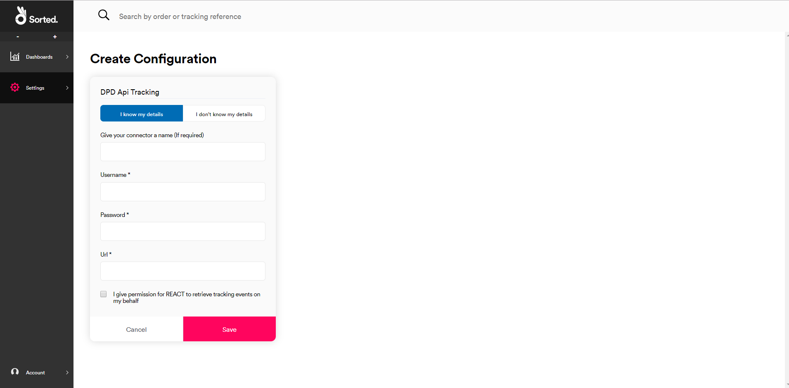   

3. Enter the required details. The information required varies from carrier to carrier.

4. Click the check box at the bottom to confirm that you give permission for REACT to retrieve tracking events on your behalf and then click **Save** to create the connector.
   
   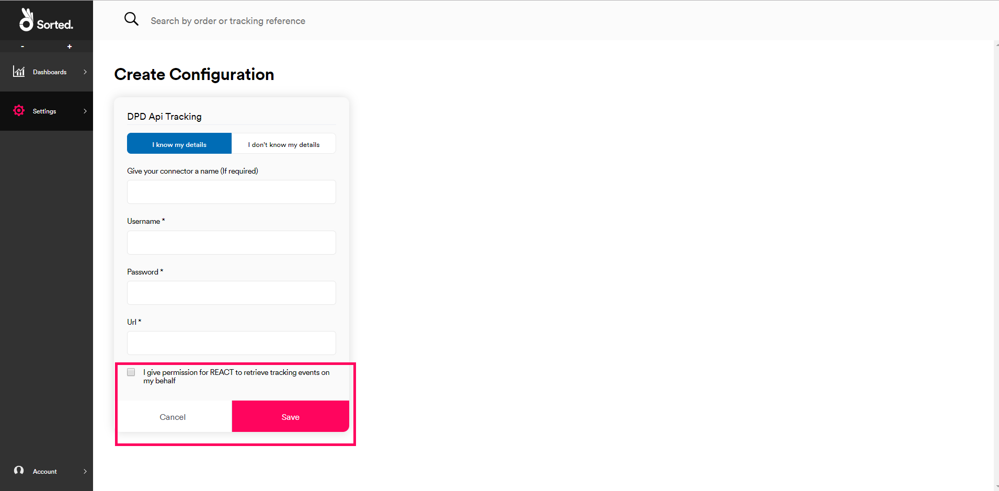

If required, you can set up multiple instances of the same connector. For example, you might have multiple accounts with a particular carrier. In this circumstance, each of those accounts would need its own connector. 

### Editing Existing Carrier Connectors

To edit an existing carrier connector, open the **Settings > Carrier Connectors** UI page and click **Edit** on the connector you want to edit. Existing carrier connectors are displayed as tiles in the **Current Carrier Connectors** section of the screen.

   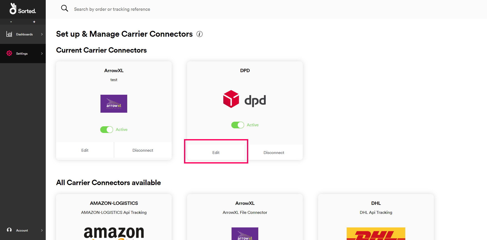   

REACT displays the **Edit Configuration** page for that carrier. Make the required edits and click **Save** to save your changes.

### Deactivating Existing Carrier Connectors

To deactivate an existing carrier connector, open the **Settings > Carrier Connectors** UI page and click the **Active** toggle on the connector's tile. The toggle switches to the **Inactive** position, confirming that the connector has been deactivated. 

   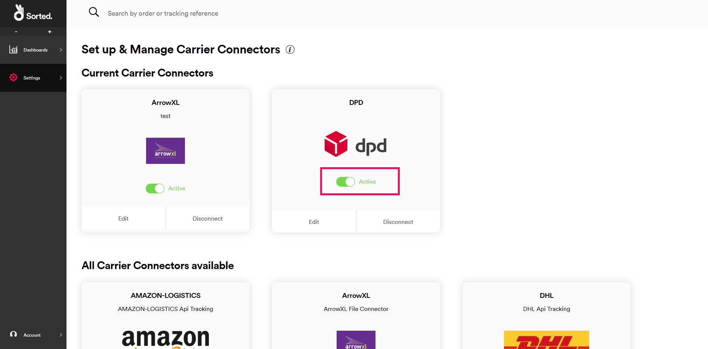   

Deactivating a carrier connector means that REACT can no longer retrieve data via that carrier integration. However, the carrier's configuration is saved, and the carrier can be reactivated by clicking the toggle again.

To permanently disconnect a carrier, open the **Settings > Carrier Connectors** UI page and click the **Disconnect** button on the connector's tile.

   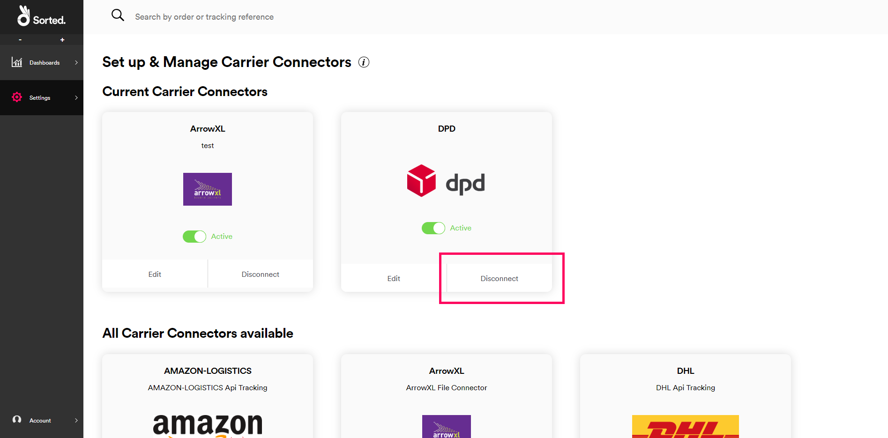   

A confirmation dialog is displayed. Click **Yes** to disconnect the carrier.

Disconnecting a carrier connector deactivates it and deletes all of its configuration. To reinstate a disconnected carrier connector you would need to set it up again as a new connector.

### User Access

Only Admin users can view, edit and delete carrier connectors.

## Setting up Custom State Labels

Shipment state labels enable you to explain shipment states in your own brand tone of voice, using language that your customers will understand. REACT returns shipment state labels in the `state_label` field of the **Shipment**, **Shipment Event**, and **Shipment Tracking Event** resources.

REACT's **Customise Shipment State Labels** page enables you to configure custom shipment state labels in the following languages:

* English (United Kingdom)
* English (United States)
* German (Germany)
* French (France)
* Spanish (Spain)
* Italian (Italy)
* Russian
* Japanese

All shipment state label fields are optional. If you leave a label field blank, then REACT returns the shipment state's default name as the label. 

To set up custom shipment state labels:

1. Open the **Settings > Custom State Labels**  UI page to display REACT's shipment states. Each shipment state tile contains any labels that are currently configured for that state.
   
   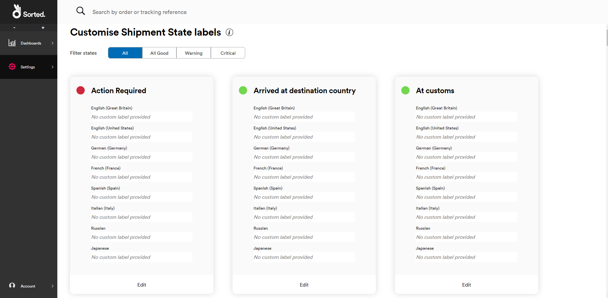

   > [!TIP]
   >
   > The **Filter States** buttons at the top of the page enable you to filter the states displayed by red / amber / green status.   

2. Click the **Edit** button on the state you want to edit. 
   
   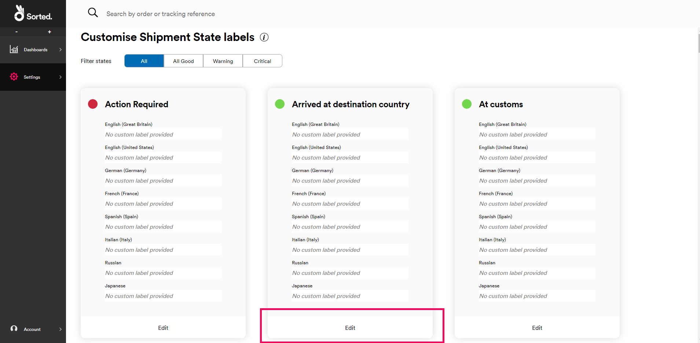  
   
   The edit page for that state is displayed. 
   
   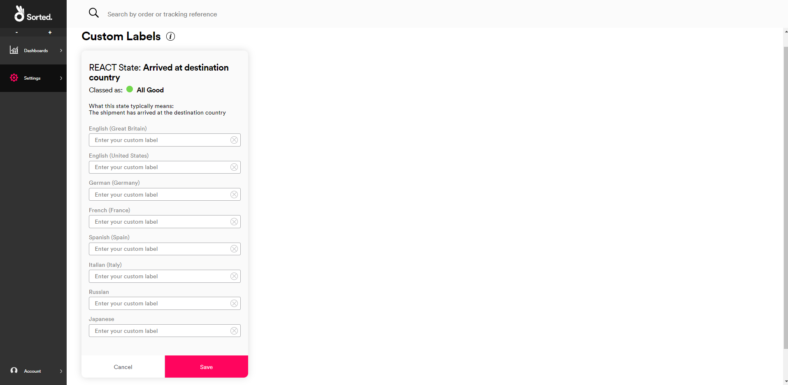  

3. Enter the required labels for that shipment state into the language fields and then click **Save** to save your changes.

### Selecting Label Language

By default, REACT's APIs and webhooks return labels in `en-gb` (English - United Kingdom). To retrieve labels in languages other than `en-gb`, add an `accept-language` header with the relevant language code as its value to your API request.

For example, to retrieve language labels in German, you would first need to use the **Customise Shipment State Labels** page to add German labels to your shipment states. You would then add an `accept-language` header with a value of `de` to any API requests you made. In its responses, REACT would populate the `state_label` field with your German labels.

### User Access

Admin and Marketing users can view, edit and delete custom state labels. Dashboard users do not have access to this feature.

## Next Steps

Learn more about the REACT UI:

* [Monitoring Shipments](/react/help/monitoring-shipments.html)
* [Managing Webhooks](/react/help/managing-webhooks.html)
* [User Management](/react/help/user-management.html)