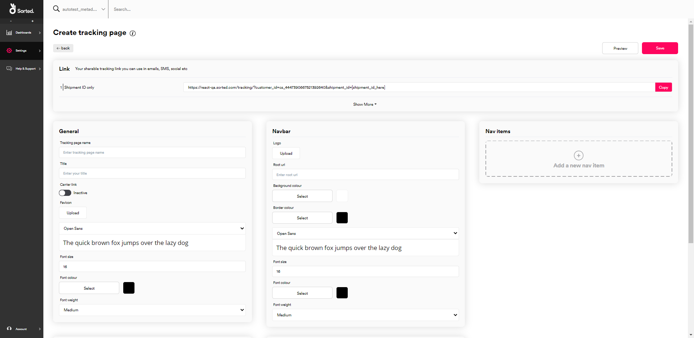
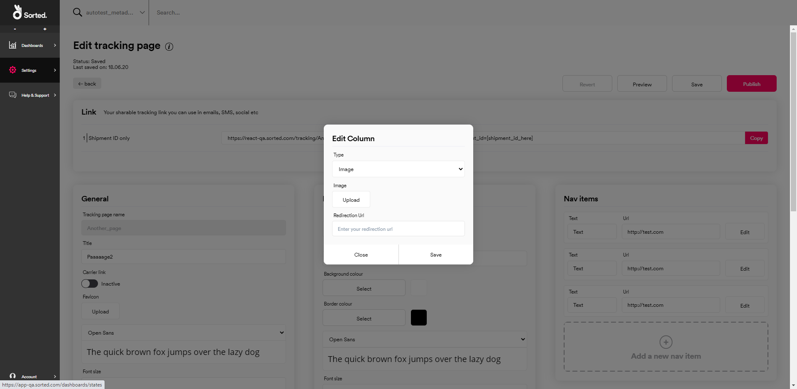

# Creating Tracking Pages

REACT's handy **Create Tracking Page** feature enables you to build branded shipment tracking pages in minutes, with no coding required. This page explains how REACT tracking pages work, how to set up new pages, and how to manage your existing pages.

---

## What Is A Tracking Page?

A REACT tracking page is a customisable microsite, hosted by Sorted, that displays status and event information about an individual shipment or group of shipments. Your customers can track their order simply by visiting the link that corresponds to their shipment. 

All REACT tracking pages have the same basic layout, with a navigation bar at the top of the page and a grid of page elements (such as tracking information, text or graphics) underneath.

   

You can create as many tracking page layouts as you need. For example, a shoe retailer could use different custom layouts to track men's, women's, and kid's shoes.

> Note:
>
> This page explains how to set up tracking pages using REACT's **Create Tracking Page** UI option. It does not cover integrating your own websites or apps with REACT's tracking API. For information on using REACT to power tracking within your own websites or apps, see the [Retrieving Shipment and Event Data](/react/help/retrieving-data.html) page.

## Creating New Tracking Pages

To create a new page layout, select **Settings > Tracking Pages** and select the **Create New Tracking Page** tile to display the **Create Tracking Page** menu.

   

The **Create Tracking Page** menu has six sections:

* **Link** - Displays sharable tracking links to your page.
* **General** - Configure general details about your page, including default titles, colours and fonts.  
* **Nav Bar** - Customise the look and feel of your page's nav bar.
* **Nav Items** - Configure the links that will appear on your page's nav bar. 
* **Desktop Layout** - Select the elements you want your tracking page to display when viewed on a desktop computer, and specify where these elements should be placed.
* **Mobile Layout** - Select the elements you want your tracking page to display when viewed on a mobile device.

To see what your page would look like while you're configuring it, click **Preview** at the top of the page. 

To save your page before publishing, click **Save**. Bear in mind that you can't change the **Title** of your page once it's been saved. 

To publish your page, click **Publish**. Publishing your page makes it accessible to customers.

   

## Configuring General Page Details

   

To configure general page details:

1. Enter a **Tracking Page Name** for the layout. This value is used as part of the page's link. 
     
>Note:
>
> Choose your page's **Tracking Page Name** carefully, as you can't update it once you've saved the page. Note that you can't have two pages with the same **Tracking Page Name**.
>
> For more information on how your customers can access tracking pages once they are published, see the [Publishing Your Page](#publishing-your-page) section.
     
2. Enter a **Title** for your page. This value is displayed on the page's browser tab, and is also used as the title of the page's tile on the **Create & Manage Tracking Pages** menu.
3. Select whether you want the **Carrier Link** to be _Active_ or _Inactive_. All REACT tracking pages include a carrier tracking reference. If you set the **Carrier Link** to _Active_, then clicking on this reference takes customers to the relevant carrier tracking portal.
4. Select a **Favicon** by clicking the **Upload** button and selecting an image from the dialog box. There is no size limit on this individual image, but your page cannot exceed more than 5MB of images in total.
5. Select the default font that REACT should use on the page.
6. Specify a default **Font Size**.
7. Select a **Font Colour** by clicking the **Select** button and choosing a colour from the picker.
8. Select a default **Font Weight**.

## Configuring the Nav Bar

All REACT tracking pages have a nav bar at the top. The nav bar contains links to locations of your choice. For example, a clothing retailer might create links from their tracking page to the men's, women's, and kid's sections of their online store.

### Configuring Nav Bar Appearance

To configure the appearance of your page's nav bar, use the **Navbar** panel:

   

1. Select a **Logo** by clicking the **Upload** button and selecting an image from the dialog box. There is no size limit on this individual image, but your page cannot exceed more than 5MB of images in total. The logo is automatically resized to fit the nav bar, and is displayed on the top-left of the page.
2. Enter a web link into the **Root URL** field. Users are redirected to this link when they click the page's logo.
3. Select a **Background Colour** by clicking the **Select** button and choosing a colour from the picker. This is the colour of the nav bar itself.
4. Select a **Border Colour** by clicking the **Select** button and choosing a colour from the picker. This is the colour of the border at the bottom of the nav bar.
5. Select the font that REACT should use on the nav bar. 
6. Select a **Font Colour** by clicking the **Select** button and choosing a colour from the picker. This is the colour of the nav bar's text.
7. Select a **Font Size** and **Font Weight** for the nav bar's text.

>Note:
>
> The font options on the **Navbar** panel override any page-wide options you may have selected in the **General** panel.

### Configuring Nav Bar Links

To add items to your page's nav bar, use the **Nav Items** panel:

   

1. Click the **Add a new nav item** tile. REACT displays the **Add Link** dialog.

2. Enter the **Text** that you want the item to display.
3. Enter the **URL** that you want the item to link to.
4. Click the **Update** button to close the dialog and add the nav link.

To rearrange an existing nav bar item, click **Edit** and select **Move Up** or **Move Down** as required. Moving an item up the list moves it to the left on the displayed tracking page, and vice versa.

To delete an existing nav bar item, click **Edit** and select **Delete**.

   

## Configuring Page Layout

REACT tracking pages offer separate, fully responsive layouts for desktop and mobile. You can configure these layouts via the **Desktop** and **Mobile** panels. 

   

Tracking pages are laid out on a grid system, with each layout having up to five rows, and each row having up to four columns on desktop, and a single column on mobile. Each column can contain a single page element (such as tracking widgets, text or images). 

As an example, the following graphic shows a desktop page made up of the following elements:

* A large-height top row containing three columns, with two images and the tracking widget itself.
* A small-height middle row containing four columns, all of which contain text links.
* A medium-height bottom row containing two columns, with both containing images.

### Editing Rows

To add new rows:

1. Click the **Add a row** tile on either the **Desktop** or **Mobile** panel to display the **Add Row** dialog.

2. Select the row **Height** required.
3. If you are setting up a row in the desktop layout, select the number of **Columns** the row should have. This option is not available for mobile layouts, as all mobile rows have one column.
4. Click **Add** to close the dialog and add the new row.

To delete an existing row, click the row's **Edit** button and then click **Delete**.

### Configuring Page Elements

REACT supports the following page element types:

* **Status_timeline** - A tracking widget displaying the shipment's current status, estimated delivery date and a timeline of tracking events. If no tracking information is available, REACT displays a blank widget.

* **Text + Image** - Displays an image with accompanying overlay text.   
* **Text** - Text only.
* **Image** - An image with no text.

By default, the top row of desktop layouts contains a **Status_timeline** element and two **Text** elements, and the top row of mobile layouts contains a single **Status_timeline** element. These rows cannot be deleted or moved, but you can edit the default row elements and add additional rows underneath.

To configure row elements, click **Edit** on the element you want to configure to display the **Edit Column** dialog.

Next, select the **Type** of element you want to add. The fields required differ depending on element type.

**Status Timeline**

To configure a **Status Timeline** element:

1. Select **Status Timeline** from the **Type** menu.
2. Select whether you want to view _Locale_ labels or _Shipment State_ labels from the **Choose Display Type** menu. If you select _Locale_ labels, then the page will display your custom shipment state labels instead of state names. If you select _Shipment State_ labels, then the page will display default state names.

> More Information:
>
> For more information on configuring custom shipment labels, see the [Setting up Custom State Labels](/react/help/settings.html#setting-up-custom-state-labels) section of the **Settings** page.

3. If you selected _Locale_ in the previous step, select which locale you want to use for the page's labels from the **Locale** menu.
4. Select the font that REACT should use on the element. 
5. Select a **Font Colour** by clicking the **Select** button and choosing a colour from the picker.
6. Select a **Font Size** and **Font Weight** for the element's text.

> Note:
>
> You can only add **Status Timeline** elements to the top row of your tracking page. The option is not displayed when editing elements on lower rows.

**Image + Text**

To configure an **Image + Text** element:

1. Select **Image + Text** from the **Type** menu.
2. Select an **Image** by clicking the **Upload** button and selecting an image from the dialog box. There is no size limit on this individual image, but your page cannot exceed more than 5MB of images in total.
3. Enter the **Text** you want the element to display. 
4. Select a **Text Position**. This is the position in which the text will be displayed within the element, enabling you to avoid having key parts of your image obscured by text.
5. Enter a **Redirection URL**. Users are redirected to this link when they click the element.
6. Select the font that REACT should use on the element. 
7. Select a **Font Colour** by clicking the **Select** button and choosing a colour from the picker.
8. Select a **Font Size** and **Font Weight** for the element's text.

**Text**

To configure a **Text** element:

1. Select **Text** from the **Type** menu.
2. Enter the **Text** you want the element to display.
3. Select a **Text Position**. This is the position in which the text will be displayed within the element.
4. Enter a **Redirection URL**. Users are redirected to this link when they click the element.
5. Select the font that REACT should use on the element. 
6. Select a **Font Colour** by clicking the **Select** button and choosing a colour from the picker.
7. Select a **Font Size** and **Font Weight** for the element's text.

**Image**

To configure an **Image** element:

1. Select **Image** from the **Type** menu.
2. Select an **Image** by clicking the **Upload** button and selecting an image from the dialog box. There is no size limit on this individual image, but your page cannot exceed more than 5MB of images in total.
3. Enter a **Redirection URL**. Users are redirected to this link when they click the element.

Lastly, click **Save** to close the dialog and save the element's details.         

## Publishing Your Page

Once you're happy with your page, click **Publish** to publish it. 

You can now share the link to the page with your customers. The **Link** panel displays sharable links to your page, using various combinations of shipment properties to identify the shipment or shipment group to be tracked.

### Linking to Individual Shipments

Links to individual pages take the format `https://react.sorted.com/tracking/[page_Title]?customer_Id=[customer_Id]&shipment_Id=[shipment_Id]&tracking_reference=[tracking_reference]&custom_reference=[custom_reference]`, where `page_Title` is the title of your tracking page and `customer_Id` is your REACT customer ID.  

There are three search parameters you can use when passing links to your consumer so that they can identify an individual shipment; `shipment_Id`, `tracking_reference` and `custom_reference`.

REACT uses the following logic when identifying shipments to be tracked:

* If you specify a `shipment_Id` then REACT uses that value alone to identify the shipment, as the REACT Shipment ID is a unique identifier for every shipment registered with REACT.
* If you specify a `tracking_reference`, `custom_reference`, or both, then REACT searches for all shipments with those details created in the last month and displays details for the first shipment found.
* If no parameters are provided, the REACT returns an error.

As an example, suppose that a retailer with a `customer_Id` of *cs_1234567890* creates a page with a `page_Title` of *awesomepage*. That retailer then registers a shipment with the following details: 
    
* `shipment_Id` of *sp_0987654321* 
* `tracking_reference` of *demo_tracking_ref*
* `custom_reference` of *demo_custom_ref*

In order for that shipment's consumer to track the page, the retailer passes the following link to the consumer:

`https://react.sorted.com/tracking/awesomepage?customer_Id=cs_1234567890&shipment_Id=sp_0987654321`

However, if the retailer did not have the REACT shipment ID of that shipment to hand, they could also pass the below link to the consumer:

`https://react.sorted.com/tracking/awesomepage?customer_Id=cs_1234567890&tracking_reference=demo_tracking_ref&custom_reference=demo_custom_ref`

In this example, both of these links would point to the same shipment.

## Linking to Shipment Groups

REACT shipment groups are collections of shipments that share a common metadata property. Grouped shipments can be tracked from the same tracking page, with a drop-down picker on the tracking widget enabling the customer to select which shipment's tracking information they want to view. This is useful in circumstances where an order would take more than one shipment to fulfil, for example.

Tracking page links to shipment groups take the format `https://react.sorted.com/tracking/[page_title]?customer_id=[customer_id_here]&metadata_key=[metadata_key_here]&metadata_value=[metadata_value_here]`, where `[page_title]` is the title of your tracking page, `[customer_id_here]` is your REACT customer ID, and the metadata key and value are the properties that the shipments share.

As an example, suppose that a customer with a `customer_id` of _cs_1234567890_ creates a tracking page called _examplePage_. The customer then registers two shipments from the same order, grouping them together using a metadata key of `order_ref` with a value of _1234_. To enable their customer to track both shipments on the order from the same page, they would share the following link: 

`https://react.sorted.com/tracking/examplePage?customer_id=cs_1234567890&metadata_key=order_ref&metadata_value=1234`

Note that REACT only displays the drop-down shipment picker and grouping information if you access the shipment via the shipment group link (that is, you use the shared metadata `key` and `value` to identify the shipments to be displayed). You can still use other valid tracking page link formats to view a shipment that is in a group, but REACT does not display links to other shipments in the group in this case.

> More Information:
>
> For more information on grouping REACT shipments, see the [Grouping Shipments](/react/help/grouping-shipments.html) page.

## Managing Existing Pages

To edit an existing page, select **Settings > Tracking Pages** to display the **Create & Manage Tracking Pages** menu, and click the **View** button on the page's tile. The process of editing an existing page is the same as that used to set up a new page.

To preview an existing page, click the context menu on the page's tile and select **Preview** from the drop-down menu.

To duplicate an existing page, click the context menu on the page's tile and select **Duplicate** from the drop-down menu.

To delete an existing page, click the context menu on the page's tile and select **Delete** from the drop-down menu.

## User Access

Admin and Marketing users can view, edit and delete tracking pages. Dashboard users do not have access to this feature.

## Next Steps

Learn more about the REACT UI:
* [Monitoring Shipments](/react/help/monitoring-shipments.html)
* [Settings](/react/help/settings.html)
* [User Management](/react/help/user-management.html)