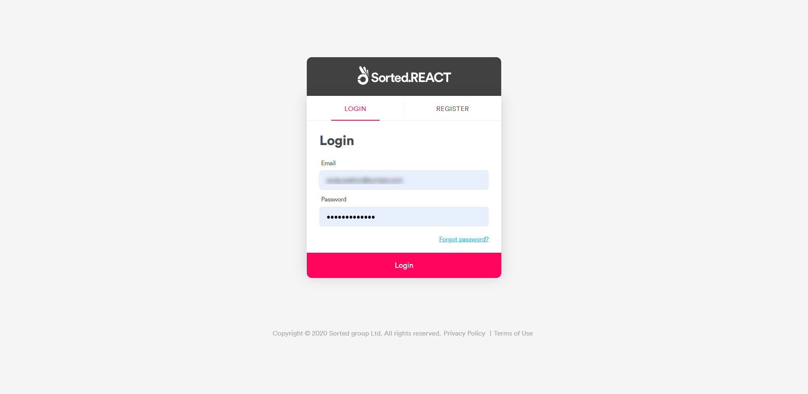

# UI Help

The SortedREACT UI gives a graphical front-end to REACT, enabling administrators to configure the system and also offering shipment monitoring functions for users with _Marketing_ and _Dashboard_ user permissions. This section of the site explains how to use the UI's various functions.

---

## Accessing the REACT UI

To access the REACT UI, first navigate to `app.sorted.com/login` to display the login panel.

   

Enter your **Email** and **Password** and click **Login** to open the **Home Dashboard** page.

You must have a REACT account set up in order to log in to the UI. If you do not have an account set up, contact your REACT administrator. 

> [!NOTE]
>
> Each REACT customer has a primary user. This is the "original" admin user that was created during the initial customer setup process. For any login issues with your primary account, contact Sorted support.
>
> For more information on user management in REACT, see the [User Management](/react/help/user-management.html) page.

## UI Help Contents

The PRO UI enables you to perform the following tasks:

* [Managing Webhooks](managing-webhooks.md) - REACT's webhooks notify you of shipping events proactively. Whenever a shipment enters a selected state, REACT will send that shipment’s data to you, thereby enabling you to build services such as push notifications as email alerts.
* [Monitoring Shipments](monitoring-shipments.md) - The dashboard offers advanced monitoring features, enabling you to view shipment locations on a map and drill down to get information on individual shipments.
* [Creating Tracking Pages](tracking-pages.md) - REACT's Create Tracking Page feature enables you to build branded shipment tracking pages in minutes, with no coding required.        
* [Configuring Notifications](notifications.md) - REACT's Notifications feature enables you to set up automated email and SMS delivery notifications for your customers without any development work.
* [Configuring Settings](settings.md) - The UI's **Settings** page enables you to configure API keys, SFTP accounts, carrier connectors and custom state labels.
* [User Management](user-management.md) - The UI's **User Management** page enables admin users to invite new users within their organisation, define user permissions, and revoke user access.

